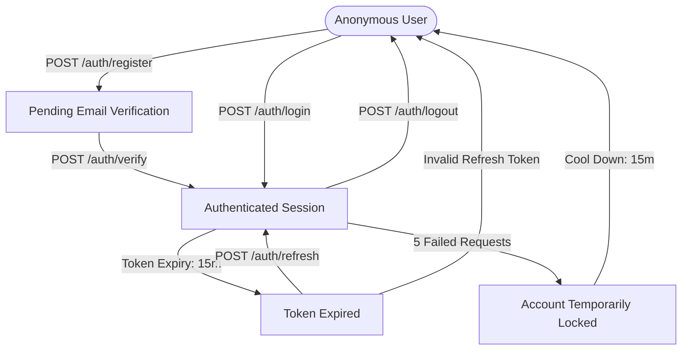

# PlacementOS: Authentication Domain Specification
**Document Version:** 1.0.0  
**Status:** Approved  
**Author:** Principal Security Architect & Senior Full Stack Lead  

---

## Table of Contents
1. [Authentication Philosophy](#1-authentication-philosophy)
2. [User Journey (State Flows)](#2-user-journey-state-flows)
3. [Authentication States](#3-authentication-states)
4. [Authentication Database Model](#4-authentication-database-model)
5. [JWT Strategy](#5-jwt-strategy)
6. [Password Strategy](#6-password-strategy)
7. [Session Strategy](#7-session-strategy)
8. [Authorization Model](#8-authorization-model)
9. [Backend Responsibilities](#9-backend-responsibilities)
10. [Frontend Responsibilities](#10-frontend-responsibilities)
11. [Validation Rules](#11-validation-rules)
12. [Security Model](#12-security-model)
13. [Error Model](#13-error-model)
14. [Audit Model](#14-audit-model)
15. [Testing Strategy](#15-testing-strategy)
16. [Folder Structure](#16-folder-structure)
17. [Implementation Order](#17-implementation-order)
18. [Definition of Done](#18-definition-of-done)
19. [Future Extensions](#19-future-extensions)
20. [Engineering Summary](#20-engineering-summary)

---

## 1. Authentication Philosophy

PlacementOS uses a **Stateless Access Token + Stateful Refresh Token** authentication pattern:

```
                  ┌──────────────────────────────────────────────┐
                  │                 JWT Auth Flow                │
                  └──────────────────────────────────────────────┘
 [Client] ────(POST /login)────► [Server] ──(Validates credentials)──► [DB: Set active token]
    ▲                                                                         │
    │◄───(200 OK: JWT + Refresh Token Cookie)─────────────────────────────────┘
```

### Why Stateless JWT + Stateful Refresh?
* **Access Tokens (JWT):** Passed in memory and validated locally by the API servers without querying the database, keeping API response times low.
* **Refresh Tokens:** Stored as HTTP-only cookies and tracked in the database, allowing the server to revoke active sessions if security issues occur.
* **Trade-offs:** If a JWT token is compromised, it remains valid until it expires. To minimize this risk, JWT lifetimes are limited to 15 minutes.

---

## 2. User Journey (State Flows)

This diagram tracks the lifecycle of an user session from registration to expiry:



---

## 3. Authentication States

* **Anonymous:** Unauthenticated state. The user can only access public routes (like login and registration pages).
* **Pending Verification:** The account is registered, but the email address must be verified before the user can access the system.
* **Authenticated:** Active login state. The client possesses a valid JWT access token.
* **Expired:** The JWT token is invalid, but the session can be restored using a valid refresh token.
* **Locked:** Account access is temporarily blocked due to multiple failed login attempts.
* **Password Reset:** State where password changes are allowed using a verified one-time token.

---

## 4. Authentication Database Model

The database tracks users, refresh tokens, and login history:

### Entities Definition
* **User:** Holds profile details, hashed credentials, and account status flags.
* **RefreshToken:** Tracks active session tokens.
* **SecurityAuditLog:** Logs logins, updates, and configuration changes.

### Schema Relationships
* One `User` can have multiple `RefreshToken` records (allowing logins from multiple devices).
* One `User` can have multiple `SecurityAuditLog` entries.

### Indexing Requirements
* Unique index on `User.email`.
* B-Tree index on `RefreshToken.tokenHash` to speed up session lookups.
* Index on `SecurityAuditLog.userId` for trace reporting.

---

## 5. JWT Strategy

### Token Parameters
* **Access Token:**
  * Lifetime: 15 minutes.
  * Location: Managed in memory by the client application.
  * Payload Claims: `sub` (User ID), `email`, `role`, `exp` (Expiry Epoch).
* **Refresh Token:**
  * Lifetime: 7 days.
  * Location: Stored in a secure, HTTP-only, SameSite=Strict cookie.
  * Payload Claims: `jti` (Token ID), `sub` (User ID), `exp`.

### Token Rotation & Revocation
* When a refresh token is used, the server invalidates it and issues a new pair to the client (Refresh Token Rotation).
* If a duplicate refresh token is used, the server revokes all active tokens for that user to protect against session theft.

---

## 6. Password Strategy

* **Hashing Algorithm:** bcrypt using a work factor of 12.
* **Complexity Rules:** Minimal password requirements:
  * Minimum 12 characters.
  * At least one uppercase letter.
  * At least one lowercase letter.
  * At least one number.
  * At least one special symbol.
* **Reset Flow:** Generates a secure, single-use token that expires after 1 hour. Reset actions are logged to the security audit database.

---

## 7. Session Strategy

* **Multi-Device Support:** Users can log in from multiple devices. Each login generates an independent `RefreshToken` record in the database.
* **Single Logout:** Deletes the local session cookie and invalidates the active refresh token in the database.
* **Global Logout ("Log out all devices"):** Inactivates all active `RefreshToken` records associated with the user's ID.

---

## 8. Authorization Model

* **System Roles:**
  * `USER`: Standard permissions. Can edit their own practice logs and applications.
  * `FACULTY`: Can read user analytics and submit mock interview feedback.
  * `ADMIN`: Full access, including system configurations and database audits.
* **Permissions Handling:** Middleware resolves permissions using the role payload claims inside the JWT token.
* **Data Ownership:** Services confirm the user's ID matches the owner ID of the record before updating data:
  `resource.userId === currentUser.id`

---

## 9. Backend Responsibilities

* **Routes:** `/api/v1/auth/register`, `/api/v1/auth/login`, `/api/v1/auth/refresh`, `/api/v1/auth/logout`, `/api/v1/auth/reset-password`.
* **Middlewares:**
  * `requireAuth`: Parses the Authorization header, validates the JWT, and blocks unauthenticated requests.
  * `rateLimiter`: Blocks multiple login attempts from the same IP address.
* **DTO Validation:** Zod schemas check payload shapes before data is passed to downstream services.

---

## 10. Frontend Responsibilities

* **Protected Routes:** React Router layout wrappers block unauthenticated users and redirect them to the `/login` page:
  ```tsx
  // Concept: <ProtectedRoute><Dashboard /></ProtectedRoute>
  ```
* **Axios Interceptors:** Interceptors check for expired token responses (`401 Unauthorized`). If a request fails, the client attempts to renew the token in the background before retrying the call:
  ```mermaid
  graph TD
      Request[Request Fails: 401] --> Refresh[Call POST /auth/refresh]
      Refresh -->|Success| Retry[Retry Original Request]
      Refresh -->|Failure| Logout[Clear State & Redirect to Login]
  ```
* **Auth Store:** Zustand manages the authenticated user's profile and active session state.

---

## 11. Validation Rules

Validation rules are enforced using Zod schemas on both the client and server:

* **Email:** Pinned to valid email formats, lowercased, and limited to 255 characters.
* **Username:** Alphanumeric characters only, between 3 and 30 characters.
* **Password:** Verified against password complexity rules (12+ characters, uppercase, lowercase, numbers, symbols).

---

## 12. Security Model

* **Brute Force Protection:** Temporarily locks accounts for 15 minutes after 5 consecutive failed login attempts.
* **CSRF Mitigation:** Access tokens are stored in application memory, which prevents typical CSRF cookie vulnerability attacks.
* **XSS Defenses:** Secure, HTTP-only cookies prevent malicious scripts from reading refresh tokens.
* **Session Hijack Prevention:** If a refresh token is reused, the server revokes the user's entire session list.

---

## 13. Error Model

Errors use standard JSON formats with unique error codes:

* `AUTH_FAILED`: Invalid email or password (HTTP 401).
* `TOKEN_EXPIRED`: The JWT access token has expired (HTTP 401).
* `ACCOUNT_LOCKED`: Access is blocked due to failed login attempts (HTTP 423).
* `VALIDATION_FAILED`: Payload input parameters do not match schemas (HTTP 400).

---

## 14. Audit Model

The `SecurityAuditLog` table tracks key authentication events:

* **Logged Fields:**
  * `id` (UUID v4)
  * `userId` (UUID, Optional)
  * `eventType` (`LOGIN_SUCCESS`, `LOGIN_FAILED`, `LOGOUT`, `PASSWORD_CHANGE`, `ACCOUNT_LOCKED`)
  * `ipAddress` (String)
  * `userAgent` (String)
  * `timestamp` (DateTime)

---

## 15. Testing Strategy

* **Unit Testing:** Verify password hashing logic, Zod validation schemas, and JWT generation parameters.
* **Integration Testing:** Test API endpoints using Supertest. Mock database interactions to verify login logic, token rotations, and token expirations.
* **Security Testing:** Verify that brute-force limits trigger correctly and that access tokens cannot be read after session logs are cleared.
* **E2E Testing:** Verify the login flow in a browser using Playwright, checking that users are redirected to the dashboard after authentication.

---

## 16. Folder Structure

Auth files are organized into feature folders inside the client and server applications:

### Frontend Auth Layout
```text
apps/web/src/domains/auth/
├── components/
│   ├── LoginForm.tsx
│   └── RegisterForm.tsx
├── hooks/
│   └── useAuth.ts
├── stores/
│   └── authStore.ts
└── services/
    └── authApi.ts
```

### Backend Auth Layout
```text
apps/api/src/domains/auth/
├── auth.controller.ts
├── auth.service.ts
├── auth.repository.ts
├── auth.routes.ts
├── auth.validators.ts
└── auth.dto.ts
```

---

## 17. Implementation Order

Implement authentication step-by-step in the following order:

1. **Database Schema:** Define tables (User, RefreshToken, AuditLog) in the Prisma schema.
2. **Password Cryptography:** Write bcrypt hashing and verification utilities.
3. **Database Repositories:** Build query interfaces for users and tokens.
4. **Token Generation Services:** Build JWT creation and verification services.
5. **API Validation Middleware:** Set up route Zod schemas.
6. **Controller Handlers:** Write Express controllers for login, registration, and logout.
7. **Frontend State & API Clients:** Configure Zustand stores and Axios token interceptors.
8. **UI Components & Guards:** Create routing guards and login forms.

---

## 18. Definition of Done

The authentication module is complete and ready for production when:

- [ ] **Tests Pass:** Unit, integration, and E2E tests run successfully.
- [ ] **Security Checks Clean:** Verify that tokens rotate correctly and that accounts lock after failed login attempts.
- [ ] **Validation Active:** All endpoints validate payloads using Zod.
- [ ] **Audit Logs Populated:** Verifiable logs are written to the database on authentication events.
- [ ] **Lint and Typecheck Clear:** Zero compiler warnings or formatting issues.

---

## 19. Future Extensions

* **OAuth Setup:** Add login hooks for Google and GitHub accounts.
* **Passkeys Integration:** Design APIs to support WebAuthn standards.
* **Multi-Factor Auth (MFA):** Set up TOTP (Google Authenticator) hooks.
* **Single Sign-On (SSO):** Add support for SAML and OpenID Connect protocols.

---

## 20. Engineering Summary

```
┌──────────────────────────────────────────────────────────────────────────┐
│                      PlacementOS Auth Architecture                       │
├──────────────────────────────────────────────────────────────────────────┘
│ Flow: JWT Access Token (15m in Memory) + Refresh Token (7d in Cookie)    │
│ Security: HTTP-only Cookies • Token Rotation (RTR) • 5-Attempt Lockout   │
│ DB Entities: User • RefreshToken • SecurityAuditLog                      │
├──────────────────────────────────────────────────────────────────────────┤
│                             SECURITY LAWS                                │
│ 1. Passwords must be hashed using bcrypt (cost factor of 12).            │
│ 2. Revoke all active sessions if a duplicate refresh token is detected.  │
│ 3. Reject API requests if the Authorization header is missing.           │
│ 4. Log all login attempts, lockouts, and password changes.               │
│ 5. Validate registration and login payloads using Zod schemas.           │
│ 6. Access tokens must contain roles (USER, FACULTY, ADMIN).              │
└──────────────────────────────────────────────────────────────────────────┘
```

---
*End of Authentication Domain Specification.*
