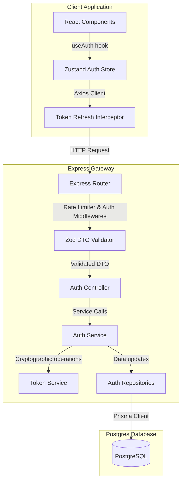
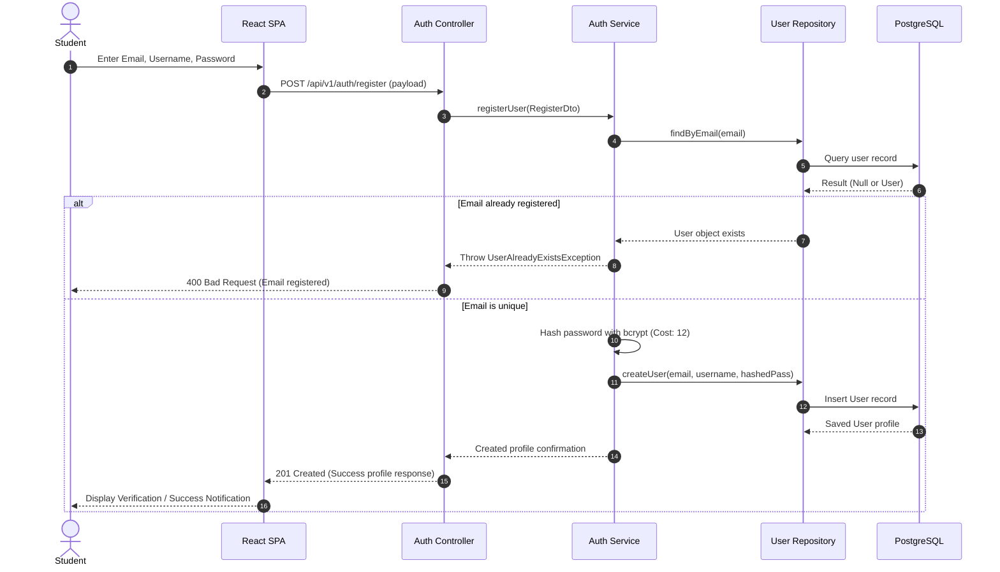
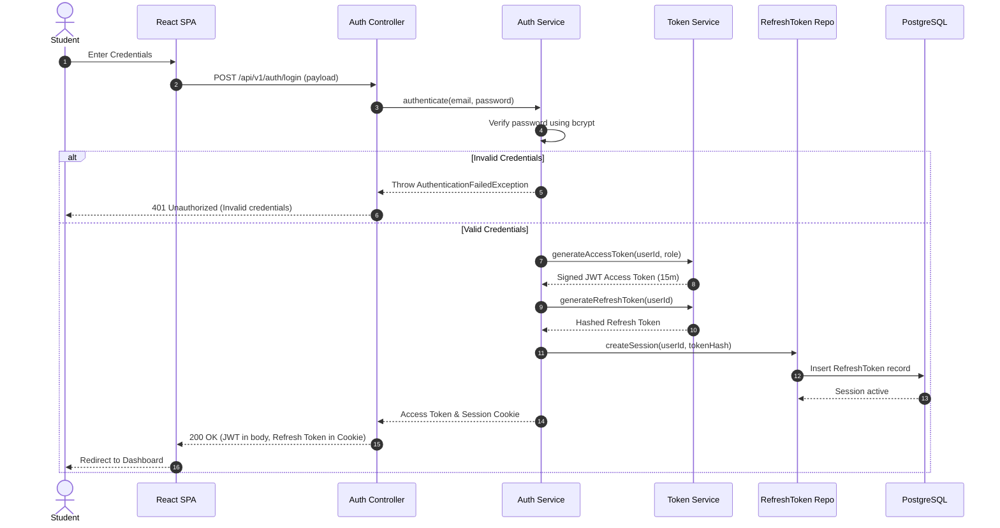
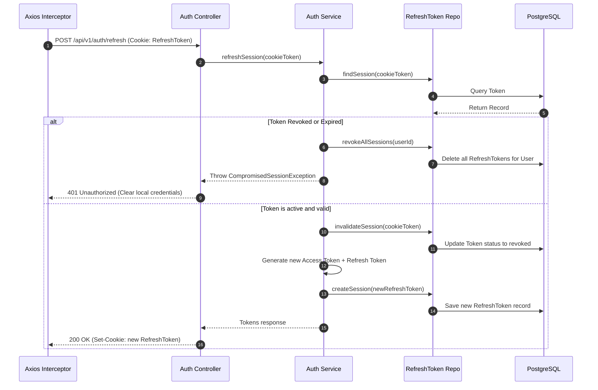
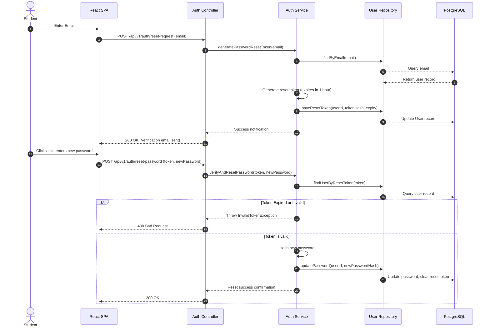

# PlacementOS: Authentication Module Technical Design Document (TDD)
**Document Version:** 1.0.0  
**Status:** Approved  
**Author:** Principal Software Architect & Principal Security Engineer  

---

## Table of Contents
1. [Overview](#1-overview)
2. [Responsibilities](#2-responsibilities)
3. [Internal Architecture](#3-internal-architecture)
4. [Sequence Diagrams](#4-sequence-diagrams)
5. [Component Interaction](#5-component-interaction)
6. [Repository Responsibilities](#6-repository-responsibilities)
7. [Service Responsibilities](#7-service-responsibilities)
8. [Validation Flow](#8-validation-flow)
9. [Token Lifecycle](#9-token-lifecycle)
10. [Database Interaction Flow](#10-database-interaction-flow)
11. [Transaction Boundaries](#11-transaction-boundaries)
12. [Concurrency Considerations](#12-concurrency-considerations)
13. [Error Flow](#13-error-flow)
14. [Retry Strategy](#14-retry-strategy)
15. [Caching Strategy](#15-caching-strategy)
16. [Logging Flow](#16-logging-flow)
17. [Audit Flow](#17-audit-flow)
18. [Performance Considerations](#18-performance-considerations)
19. [Security Review](#19-security-review)
20. [Threat Model (STRIDE Framework)](#20-threat-model-stride-framework)
21. [Failure Recovery](#21-failure-recovery)
22. [Observability](#22-observability)
23. [Configuration Requirements](#23-configuration-requirements)
24. [Testing Matrix](#24-testing-matrix)
25. [Deployment Notes](#25-deployment-notes)
26. [Future Evolution](#26-future-evolution)
27. [Summary](#27-summary)

---

## 1. Overview

This document specifies the technical design of the **Authentication and Authorization Module** for PlacementOS.

```
┌────────────────────────────────────────────────────────┐
│               Authentication Boundaries                │
└────────────────────────────────────────────────────────┘
 [React SPA] ────(HTTPS: JWT / HttpOnly Cookie)────► [Express API Gateway]
                                                            │
 [PostgreSQL Database] ◄────(Prisma Client / TCP)───────────┘
```

### Objectives
* Implement a secure **Stateless JWT Access Token + Stateful Refresh Token** authentication model.
* Mitigate session vulnerabilities (CSRF, XSS, Session Hijacking) using **Refresh Token Rotation (RTR)**.
* Standardize error formats, validation pipelines, and security audits across all application domains.

---

## 2. Responsibilities

The module is divided into six separate layers:

* **Controller Layer:** Parses requests, reads headers, validates inputs using Zod, and routes operations to services.
* **Service Layer:** Coordinates business rules, handles password hashing, and manages session state.
* **Repository Layer:** Runs database queries using Prisma.
* **Token Provider:** Handles JWT creation, signature validation, and payload decodes.
* **Middleware Layer:** Authorizes endpoints, injects trace IDs, and runs rate-limit validations.
* **Frontend SPA:** Coordinates UI views, intercepts API calls to refresh expired tokens, and manages routes protection.

---

## 3. Internal Architecture

The block diagram below maps the internal structures and dependencies of the authentication system:



---

## 4. Sequence Diagrams

### Registration Flow


### Login Flow


### Refresh Token Rotation (RTR) Flow


### Password Reset Flow


---

## 5. Component Interaction

### Frontend UI to API Request Chain
1. The **Login Form** Component catches submits, running local format checks (e.g. email validity).
2. On pass, the UI fires the `login` function inside the Zustand **Auth Store**.
3. The store calls `authApi.login` (managed by Axios).
4. If a request returns `401 Unauthorized`, the **Axios Interceptor** pauses the queue and attempts a refresh.
5. On refresh success, the interceptor re-runs the failed request. On failure, it clears state and redirects the user to the `/login` page.

---

## 6. Repository Responsibilities

Database queries are defined inside interfaces to isolate the database implementation:

### UserRepository
* `findByEmail(email: string): Promise<User | null>`
* `findById(id: string): Promise<User | null>`
* `create(data: CreateUserDto): Promise<User>`
* `updatePassword(id: string, passwordHash: string): Promise<void>`
* `incrementFailedAttempts(id: string): Promise<number>`
* `resetFailedAttempts(id: string): Promise<void>`
* `lockAccount(id: string, lockUntil: Date): Promise<void>`

### RefreshTokenRepository
* `findActiveToken(hash: string): Promise<RefreshToken | null>`
* `create(data: CreateTokenDto): Promise<RefreshToken>`
* `invalidateToken(id: string): Promise<void>`
* `revokeAllSessionsForUser(userId: string): Promise<void>`

---

## 7. Service Responsibilities

Core business services run operations in isolation:

### AuthService
* Coordinates registration steps, verifies login credentials, and invalidates sessions during logouts.
* *Dependencies:* `UserRepository`, `PasswordService`, `TokenService`, `RefreshTokenRepository`.

### TokenService
* Signs access JWT tokens and validates refresh tokens.
* *Dependencies:* Node Cryptography libraries.

### PasswordService
* Encrypts and validates password strings using bcrypt.
* *Dependencies:* `bcrypt` library.

---

## 8. Validation Flow

Zod schemas run inside Express middlewares to check request payloads before they reach controllers:

```
[Request Input] ──► [Zod Middleware Check] ──► [On Pass: Call Controller]
                             │
                      [On Fail: 400 Bad Request]
```

1. **Schema Check:** The middleware parses fields against schema definitions.
2. **Error Catch:** If validation fails, the middleware formats the Zod error details.
3. **Response Output:** The server returns HTTP 400 with a `VALIDATION_FAILED` code, listing the failed fields.

---

## 9. Token Lifecycle

Token rotation rules are defined below:

```
Active Token ──► Used for Refresh ──► Revokes Old Token ──► Issues New Token
                                                                 │
If Old Token is used again ◄─────── Revokes User Sessions ◄──────┘
```

* **Access Token Lifespan:** Valid for 15 minutes. It is stored in client memory; closing the tab deletes the token.
* **Refresh Token Lifespan:** Valid for 7 days. It is stored in a secure cookie:
  `Set-Cookie: token=[hash]; HttpOnly; Secure; SameSite=Strict; Path=/api/v1/auth`
* **Detection of Stolen Tokens:** If a revoked refresh token is presented to `/api/v1/auth/refresh`, the server assumes the token was stolen. It immediately revokes all active sessions associated with the user's ID.

---

## 10. Database Interaction Flow

* **Query Engine:** Prisma client instances handle database queries.
* **Connection Management:** Connection pools are initialized when the server starts:
  `postgresql://...&connection_limit=20`
* **Query Speed:** B-Tree indexes speed up lookups on core query columns (such as `User.email` and `RefreshToken.tokenHash`).

---

## 11. Transaction Boundaries

Database updates affecting multiple tables run inside transaction blocks to prevent inconsistent states:

* **Login Success:** Logging in updates the user's login timestamp and inserts a new session token. If the token creation fails, the transaction rolls back, preventing active sessions from falling out of sync.
* **Token Refresh:** Invalidating the old token and generating the new token must succeed or fail together.

---

## 12. Concurrency Considerations

* **Refresh Token Race Conditions:** If a client fires multiple parallel API requests while their access token is expired, they might trigger multiple refresh requests simultaneously.
* **Double-Refresh Handlers:** The API service implements a 10-second grace window during token rotation. If an old refresh token is reused within this window, the server accepts the call, preventing parallel client requests from logging the user out.

---

## 13. Error Flow

* **Central Error Filter:** Express routing uses a central error handler middleware:
  `app.use((err, req, res, next) => { ... })`
* **Payload Hiding:** In production mode, database error messages and stack traces are stripped from API responses to prevent exposing system details.

---

## 14. Retry Strategy

* **API Client Retry Rules:** If an API call fails due to a network glitch (HTTP 503), the Axios client retries the request up to 3 times using an exponential backoff strategy.
* **Login Rate Limits:** Rate-limited endpoints (HTTP 429) do not support retries. The server returns a `Retry-After` header telling the client how long to wait before trying again.

---

## 15. Caching Strategy

To prevent session synchronization errors across instances, session cache rules are configured as follows:
* **No Authentication Caching:** Query validations for logins and token refreshes read the PostgreSQL database directly, ensuring that revoked sessions are identified immediately.
* **Cache Exemption:** Access tokens require no database lookups since they are decrypted locally on the API servers using JWT signature secrets.

---

## 16. Logging Flow

* **Logger Framework:** Pino captures request metrics.
* **Correlation Tracking:** Incoming requests include a unique ID header:
  `x-correlation-id: <uuid>`
* **Log Sanitization:** Regex filters strip credentials (like `password`, `token`, and `newPassword`) from logs to ensure sensitive data is not written to files.

---

## 17. Audit Flow

* **Audit Triggers:** The system writes audit events to the database on logins, logins failures, password resets, and account locks.
* **Data Fields:** Logs store user IDs, event names, timestamps, and IP addresses.
* **Retention Policy:** Security audit logs are kept for 1 year to meet security and compliance standards.

---

## 18. Performance Considerations

* **CPU Workload:** Password verification runs bcrypt with a work factor of 12. Hashing operations run on separate worker threads to prevent blocking the main Express event loop.
* **Verification Speed:** Token signature decodes are executed in memory, keeping validation times under 2ms.

---

## 19. Security Review

* **JWT Storage:** Access tokens are stored in application memory, which prevents typical CSRF cookie vulnerability attacks.
* **XSS Defenses:** Secure, HTTP-only cookies prevent malicious scripts from reading refresh tokens.
* **Secure Cookies:** Cookies are configured with security parameters to protect data in transit:
  `Secure; HttpOnly; SameSite=Strict`

---

## 20. Threat Model (STRIDE Framework)

The STRIDE model below maps out potential threats and mitigations:

| STRIDE Threat | Identified Risk | Mitigation Strategy |
| :--- | :--- | :--- |
| **Spoofing** | Session theft by intercepting refresh tokens. | Force TLS/HTTPS. Store refresh tokens in HTTP-only, SameSite=Strict cookies. |
| **Tampering** | Modifying JWT payloads to access admin endpoints. | Sign access tokens using HS256 and verify signatures on every request. |
| **Repudiation** | Users denying actions (such as changing passwords). | Write immutable logs to the security audit database on key events. |
| **Information Disclosure** | Exposing database schema traces on failed API requests. | Configure error middleware to strip stack traces from production responses. |
| **Denial of Service** | Brute force attempts slowing down the auth server. | Limit auth endpoints to 10 requests per minute per IP address. |
| **Elevation of Privilege** | Users editing roles in their token payloads. | Validate and re-sign tokens on the backend; ignore role changes submitted by clients. |

---

## 21. Failure Recovery

* **Database Connection Outages:** If the database connection drops, token refreshes fall back to error statuses, requiring users to log in again once services restore.
* **Secret Key Rotations:** If JWT secret keys are changed, all active client sessions are invalidated, prompting users to re-login.

---

## 22. Observability

* **Metrics Captured:**
  * Active session counts.
  * Login failure rate.
  * Average token refresh latency.
* **Trace Scopes:** Transaction logs are grouped under their correlation IDs to help developers trace request lifecycles.

---

## 23. Configuration Requirements

The following environment variables must be defined on startup:

* `DATABASE_URL`: Target PostgreSQL connection string.
* `JWT_ACCESS_SECRET`: 256-bit key used to sign access tokens.
* `JWT_REFRESH_SECRET`: 256-bit key used to sign refresh tokens.
* `PORT`: Server port (default: `4000`).

---

## 24. Testing Matrix

* **Unit Tests:**
  * Validate password complexity check functions.
  * Verify token validation utilities against expired signatures.
* **Integration Tests:**
  * Confirm that rate limiters block requests after 5 failed login attempts.
  * Verify token rotation behavior on token refresh calls.
* **E2E Tests:**
  * Verify that unauthenticated users are redirected to the login page.
  * Confirm that access tokens are refreshed in the background without affecting the user.

---

## 25. Deployment Notes

* **Database Migrations:** Run migrations and seed data before deploy updates go live.
* **Zero-Downtime Deploys:** During rolling updates, run old and new server versions concurrently. The database remains compatible with both versions to prevent user interruption.

---

## 26. Future Evolution

* **OAuth Setup:** Add login hooks for Google and GitHub accounts.
* **Passkeys Integration:** Design APIs to support WebAuthn standards.
* **Multi-Factor Auth (MFA):** Set up TOTP (Google Authenticator) hooks.
* **Single Sign-On (SSO):** Add support for SAML and OpenID Connect protocols.

---

## 27. Summary

```
┌──────────────────────────────────────────────────────────────────────────┐
│                   PlacementOS Auth TDD Architecture                      │
├──────────────────────────────────────────────────────────────────────────┤
│ Scope: Stateless JWT Access Token + Stateful Cookie Refresh Token        │
│ Rotation: Single-use refresh tokens with 10s grace concurrency window    │
│ Validation: Express validator middlewares configured with Zod            │
├──────────────────────────────────────────────────────────────────────────┤
│                          IMPLEMENTATION RULES                            │
│ 1. Passwords must be hashed using bcrypt (cost factor of 12).            │
│ 2. If a revoked refresh token is reused, revoke all active sessions.      │
│ 3. Reject requests if the Authorization header is missing.               │
│ 4. Logs must strip out password and token variables before writing.      │
│ 5. Validate input payloads against Zod schemas on the backend.           │
│ 6. Audit security events (login success, failure, lock, resets).         │
└──────────────────────────────────────────────────────────────────────────┘
```

---
*End of Technical Design Document.*
