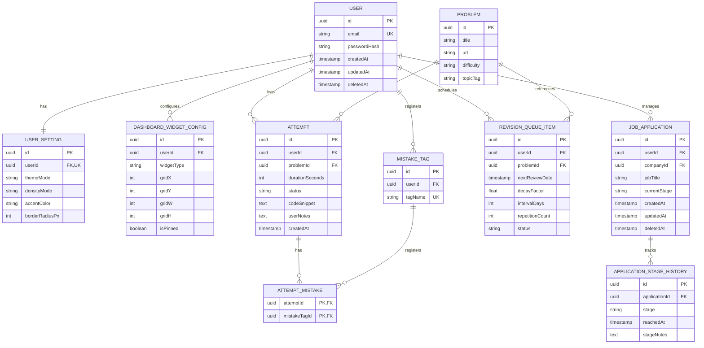
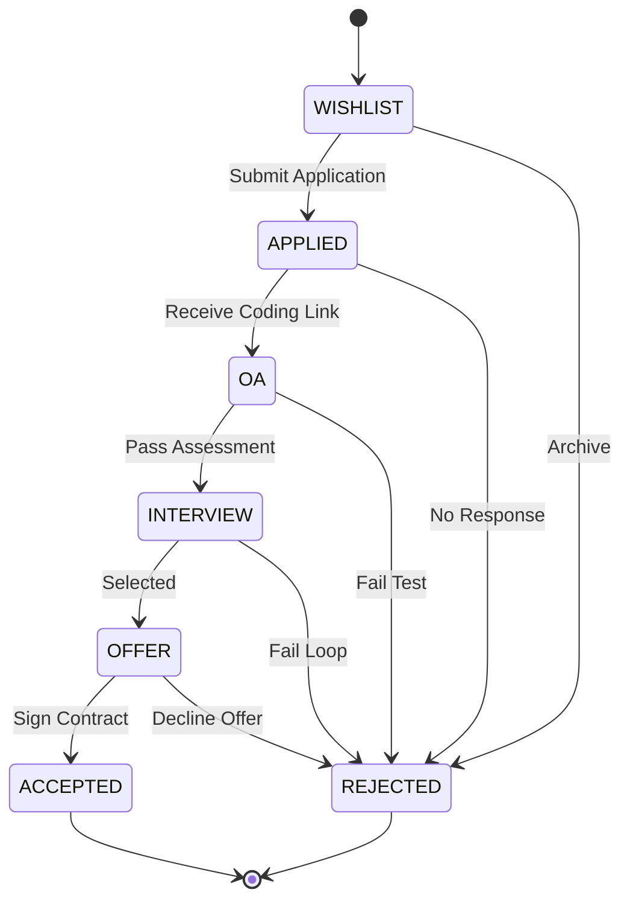
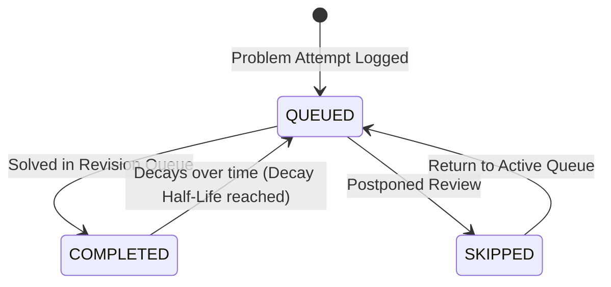

# PlacementOS: Domain Model & Database Architecture
**Document Version:** 1.0.0  
**Status:** Approved  
**Author:** Principal Domain Architect & Senior Database Architect  

---

## Table of Contents
1. [Domain Model](#1-domain-model)
2. [Entity Catalog](#2-entity-catalog)
3. [Aggregate Definitions](#3-aggregate-definitions)
4. [Value Objects](#4-value-objects)
5. [Relationships](#5-relationships)
6. [Mermaid ER Diagram](#6-mermaid-er-diagram)
7. [Ownership Rules](#7-ownership-rules)
8. [Lifecycle Diagrams](#8-lifecycle-diagrams)
9. [Business Rules](#9-business-rules)
10. [Constraints](#10-constraints)
11. [Validation Rules](#11-validation-rules)
12. [Audit Strategy](#12-audit-strategy)
13. [Soft Delete Strategy](#13-soft-delete-strategy)
14. [Index Strategy](#14-index-strategy)
15. [Partition Strategy](#15-partition-strategy)
16. [Scaling Strategy](#16-scaling-strategy)
17. [Future Migration Strategy](#17-future-migration-strategy)
18. [Complete Database Folder Structure](#18-complete-database-folder-structure)
19. [ADRs for Database Decisions](#19-adrs-for-database-decisions)
20. [Summary (One-Page Database Architecture Card)](#20-summary-one-page-database-architecture-card)

---

## 1. Domain Model

PlacementOS is structured around 7 distinct **Bounded Contexts** to organize domain models and prevent database tight coupling:

```
┌────────────────────────────────────────────────────────┐
│                    UserManagement                      │
│     (Handles authentication, settings, profiles)       │
├────────────────────────────────────────────────────────┤
│                      PracticeLog                       │
│     (Manages problems, attempts, error mappings)       │
├────────────────────────────────────────────────────────┤
│                    RevisionEngine                      │
│     (Triggers decay schedules, spaced repetition)      │
├────────────────────────────────────────────────────────┤
│                    CompanyPipeline                     │
│     (CRM tracker, resumes, job applications)           │
├────────────────────────────────────────────────────────┤
│                     KnowledgeBase                      │
│     (Manages concepts, markdown document trees)        │
├────────────────────────────────────────────────────────┤
│                   EvidenceAnalytics                    │
│     (Calculates snapshots, audit-grade verification)   │
├────────────────────────────────────────────────────────┤
│                    WorkspaceConfig                     │
│     (Dashboard widget arrangements, UI themes)        │
└────────────────────────────────────────────────────────┘
```

---

## 2. Entity Catalog

All database entities are logically defined below, grouping attributes, types, and nullability parameters:

### Domain A: UserManagement & Configs
* **User:** The base profile owner record.
  * `id` (UUID, Primary Key, Non-Nullable)
  * `email` (String, Unique, Non-Nullable)
  * `passwordHash` (String, Non-Nullable)
  * `createdAt` (Timestamp, Non-Nullable)
  * `updatedAt` (Timestamp, Non-Nullable)
  * `deletedAt` (Timestamp, Nullable)
* **UserSetting:** Config parameters linked to a user.
  * `id` (UUID, Primary Key, Non-Nullable)
  * `userId` (UUID, Foreign Key referencing User, Unique, Non-Nullable)
  * `themeMode` (Enum: `light`, `dark`, `system`, Non-Nullable)
  * `densityMode` (Enum: `comfortable`, `condensed`, Non-Nullable)
  * `accentColor` (String, Non-Nullable)
  * `borderRadiusPx` (Integer, Non-Nullable)
  * `updatedAt` (Timestamp, Non-Nullable)
* **DashboardWidgetConfig:** Individual widget grid coordinates and properties.
  * `id` (UUID, Primary Key, Non-Nullable)
  * `userId` (UUID, Foreign Key referencing User, Non-Nullable)
  * `widgetType` (String, Non-Nullable)
  * `gridX` (Integer, Non-Nullable)
  * `gridY` (Integer, Non-Nullable)
  * `gridW` (Integer, Non-Nullable)
  * `gridH` (Integer, Non-Nullable)
  * `isPinned` (Boolean, Default: false, Non-Nullable)
  * `isMinimized` (Boolean, Default: false, Non-Nullable)
  * `customProperties` (JSONB, Nullable)

### Domain B: KnowledgeBase & Notes
* **Category:** Collapsible folder nodes organizing guides.
  * `id` (UUID, Primary Key, Non-Nullable)
  * `userId` (UUID, Foreign Key referencing User, Non-Nullable)
  * `parentCategoryId` (UUID, Foreign Key referencing Category, Nullable)
  * `name` (String, Non-Nullable)
  * `sortOrder` (Integer, Non-Nullable)
* **KnowledgeNote:** Markdown documents.
  * `id` (UUID, Primary Key, Non-Nullable)
  * `categoryId` (UUID, Foreign Key referencing Category, Non-Nullable)
  * `title` (String, Non-Nullable)
  * `contentMarkdown` (Text, Non-Nullable)
  * `createdAt` (Timestamp, Non-Nullable)
  * `updatedAt` (Timestamp, Non-Nullable)
  * `deletedAt` (Timestamp, Nullable)
* **QuickNote:** Temporary scratchpad text blocks.
  * `id` (UUID, Primary Key, Non-Nullable)
  * `userId` (UUID, Foreign Key referencing User, Non-Nullable)
  * `content` (Text, Non-Nullable)
  * `updatedAt` (Timestamp, Non-Nullable)

### Domain C: PracticeLog
* **Problem:** Canonical problem catalog indices.
  * `id` (UUID, Primary Key, Non-Nullable)
  * `title` (String, Non-Nullable)
  * `url` (String, Nullable)
  * `difficulty` (Enum: `EASY`, `MEDIUM`, `HARD`, Non-Nullable)
  * `topicTag` (String, Non-Nullable) (e.g. "TREES")
* **Attempt:** Logged sessions of code practice.
  * `id` (UUID, Primary Key, Non-Nullable)
  * `userId` (UUID, Foreign Key referencing User, Non-Nullable)
  * `problemId` (UUID, Foreign Key referencing Problem, Non-Nullable)
  * `durationSeconds` (Integer, Non-Nullable)
  * `status` (Enum: `PASS`, `FAIL`, `OPTIMIZED`, Non-Nullable)
  * `codeSnippet` (Text, Nullable)
  * `userNotes` (Text, Nullable)
  * `createdAt` (Timestamp, Non-Nullable)
* **MistakeTag:** Classifiers for error trends.
  * `id` (UUID, Primary Key, Non-Nullable)
  * `userId` (UUID, Foreign Key referencing User, Non-Nullable)
  * `tagName` (String, Unique, Non-Nullable) (e.g., "OFF_BY_ONE", "TLE")
* **AttemptMistake:** Junction tracking mistakes made per attempt.
  * `attemptId` (UUID, Foreign Key referencing Attempt, Primary Key constituent, Non-Nullable)
  * `mistakeTagId` (UUID, Foreign Key referencing MistakeTag, Primary Key constituent, Non-Nullable)

### Domain D: Spaced Repetition (RevisionEngine)
* **RevisionQueueItem:** Active review targets.
  * `id` (UUID, Primary Key, Non-Nullable)
  * `userId` (UUID, Foreign Key referencing User, Non-Nullable)
  * `problemId` (UUID, Foreign Key referencing Problem, Non-Nullable)
  * `nextReviewDate` (Timestamp, Non-Nullable)
  * `decayFactor` (Float, Non-Nullable)
  * `intervalDays` (Integer, Non-Nullable)
  * `repetitionCount` (Integer, Non-Nullable)
  * `status` (Enum: `QUEUED`, `COMPLETED`, `SKIPPED`, Non-Nullable)
* **RevisionHistory:** Historical records of review attempts.
  * `id` (UUID, Primary Key, Non-Nullable)
  * `queueItemId` (UUID, Foreign Key referencing RevisionQueueItem, Non-Nullable)
  * `attemptId` (UUID, Foreign Key referencing Attempt, Non-Nullable)
  * `reviewedAt` (Timestamp, Non-Nullable)

### Domain E: CompanyPipeline & CVs
* **Company:** target employers.
  * `id` (UUID, Primary Key, Non-Nullable)
  * `name` (String, Unique, Non-Nullable)
  * `website` (String, Nullable)
* **JobApplication:** Pipeline application record.
  * `id` (UUID, Primary Key, Non-Nullable)
  * `userId` (UUID, Foreign Key referencing User, Non-Nullable)
  * `companyId` (UUID, Foreign Key referencing Company, Non-Nullable)
  * `jobTitle` (String, Non-Nullable)
  * `currentStage` (Enum: `WISHLIST`, `APPLIED`, `OA`, `INTERVIEW`, `OFFER`, `REJECTED`, `ACCEPTED`, Non-Nullable)
  * `createdAt` (Timestamp, Non-Nullable)
  * `updatedAt` (Timestamp, Non-Nullable)
  * `deletedAt` (Timestamp, Nullable)
* **ApplicationStageHistory:** Log of stage transitions.
  * `id` (UUID, Primary Key, Non-Nullable)
  * `applicationId` (UUID, Foreign Key referencing JobApplication, Non-Nullable)
  * `stage` (Enum, Non-Nullable)
  * `reachedAt` (Timestamp, Non-Nullable)
  * `stageNotes` (Text, Nullable)
* **ResumeVersion:** Uploaded or cataloged CV revisions.
  * `id` (UUID, Primary Key, Non-Nullable)
  * `userId` (UUID, Foreign Key referencing User, Non-Nullable)
  * `versionLabel` (String, Non-Nullable) (e.g. "v2.1-Backend")
  * `fileUrl` (String, Nullable)
  * `rawContent` (JSONB, Nullable)
* **ApplicationResumeLink:** Maps specific resume versions to job applications.
  * `applicationId` (UUID, Foreign Key referencing JobApplication, Unique, Non-Nullable)
  * `resumeId` (UUID, Foreign Key referencing ResumeVersion, Non-Nullable)

### Domain F: Assessments & Projects
* **MockInterview:** Managed simulation runs.
  * `id` (UUID, Primary Key, Non-Nullable)
  * `userId` (UUID, Foreign Key referencing User, Non-Nullable)
  * `companyId` (UUID, Foreign Key referencing Company, Nullable)
  * `interviewerName` (String, Nullable)
  * `scheduledAt` (Timestamp, Non-Nullable)
  * `feedbackScore` (Integer, Nullable) (Scale 1-10)
  * `notes` (Text, Nullable)
* **STARResponse:** Renders behavioral bank entries.
  * `id` (UUID, Primary Key, Non-Nullable)
  * `userId` (UUID, Foreign Key referencing User, Non-Nullable)
  * `situation` (Text, Non-Nullable)
  * `task` (Text, Non-Nullable)
  * `action` (Text, Non-Nullable)
  * `result` (Text, Non-Nullable)
  * `relatedProject` (String, Nullable)
* **Project:** Verifiable software designs.
  * `id` (UUID, Primary Key, Non-Nullable)
  * `userId` (UUID, Foreign Key referencing User, Non-Nullable)
  * `title` (String, Non-Nullable)
  * `gitRepoUrl` (String, Nullable)
  * `liveUrl` (String, Nullable)
  * `architectureNotes` (Text, Nullable)
  * `createdAt` (Timestamp, Non-Nullable)
  * `updatedAt` (Timestamp, Non-Nullable)

### Domain G: Analytics & Calendar
* **DailyAnalyticsSnapshot:** Stores compiled performance snapshots.
  * `id` (UUID, Primary Key, Non-Nullable)
  * `userId` (UUID, Foreign Key referencing User, Non-Nullable)
  * `date` (Date, Non-Nullable)
  * `solvedCount` (Integer, Non-Nullable)
  * `averageDurationSeconds` (Integer, Non-Nullable)
  * `firstPassAccuracy` (Float, Non-Nullable)
  * `activeMinutes` (Integer, Non-Nullable)
* **CalendarEvent:** Tracks scheduled preparation dates.
  * `id` (UUID, Primary Key, Non-Nullable)
  * `userId` (UUID, Foreign Key referencing User, Non-Nullable)
  * `title` (String, Non-Nullable)
  * `eventCategory` (Enum: `REVISION`, `MOCK_EXAM`, `INTERVIEW`, `APPLICATION_DEADLINE`, Non-Nullable)
  * `startTime` (Timestamp, Non-Nullable)
  * `endTime` (Timestamp, Non-Nullable)
  * `linkedResourceId` (UUID, Nullable) (e.g. `mockInterviewId` or `applicationId`)

---

## 3. Aggregate Definitions

To maintain consistency and transactional integrity, data operations are managed through defined **Domain Aggregates**:

```
┌────────────────────────────────────────────────────────┐
│                   User Aggregate                       │
│    User (Root) ──► UserSetting                         │
│                ──► DashboardWidgetConfig               │
├────────────────────────────────────────────────────────┤
│                 Practice Aggregate                     │
│    Attempt (Root) ──► AttemptMistake                   │
│                   ──► MistakeTag                       │
├────────────────────────────────────────────────────────┤
│                Application Aggregate                   │
│    JobApplication (Root) ──► ApplicationStageHistory   │
│                          ──► ApplicationResumeLink     │
└────────────────────────────────────────────────────────┘
```

1. **User Aggregate:**
   * *Root:* `User`
   * *Entities inside boundary:* `UserSetting`, `DashboardWidgetConfig`
   * *Rule:* Deleting a `User` cascade deletes their settings and dashboard configurations.
2. **Practice Log Aggregate:**
   * *Root:* `Attempt`
   * *Entities inside boundary:* `AttemptMistake`, associated local `MistakeTag` entries.
   * *Rule:* Removing an `Attempt` cleans up its junction records in `AttemptMistake` without removing the base `Problem` definitions.
3. **Job Application Aggregate:**
   * *Root:* `JobApplication`
   * *Entities inside boundary:* `ApplicationStageHistory`, `ApplicationResumeLink`, `RecruiterContact`
   * *Rule:* Stage histories and CV mappings are managed strictly through the root application instance.

---

## 4. Value Objects

Value Objects are immutable, self-contained attributes that lack independent database identities:

* **GridCoordinates:** Controls widget placements.
  * *Attributes:* `gridX` (Int), `gridY` (Int), `gridW` (Int), `gridH` (Int)
  * *Validation:* X and Y must be positive integers; W and H must fall within layout columns limits.
* **DurationSeconds:** Time taken to solve a problem.
  * *Attributes:* `seconds` (Int)
  * *Validation:* Must be greater than 0. Matches benchmark ranges (e.g., `< 3600`).
* **DecayParameters:** Inputs for spaced repetition calculations.
  * *Attributes:* `decayFactor` (Float), `intervalDays` (Int)
  * *Validation:* `decayFactor` must be between `1.0` and `5.0`.
* **ContactInfo:** Recruiter contact details.
  * *Attributes:* `name` (String), `email` (String), `phone` (String, Nullable)
  * *Validation:* Email format must match Zod pattern check rules.

---

## 5. Relationships

The relational constraints define how entities interact across domain boundaries:

| Parent Entity | Child Entity | Relationship Type | Cascade Delete Rule | Soft Delete Behavior |
| :--- | :--- | :--- | :--- | :--- |
| **User** | `UserSetting` | One-to-One | Cascade | Hard Delete |
| **User** | `DashboardWidgetConfig` | One-to-Many | Cascade | Hard Delete |
| **User** | `KnowledgeNote` | One-to-Many | Restrict | Soft Delete (sets `deletedAt`) |
| **User** | `Attempt` | One-to-Many | Cascade | Hard Delete |
| **Problem** | `Attempt` | One-to-Many | Restrict | Blocked if active attempts exist |
| **Attempt** | `AttemptMistake` | One-to-Many | Cascade | Hard Delete junction |
| **JobApplication** | `ApplicationStageHistory` | One-to-Many | Cascade | Hard Delete history |
| **JobApplication** | `ApplicationResumeLink` | One-to-One | Cascade | Hard Delete |
| **RevisionQueueItem** | `RevisionHistory` | One-to-Many | Cascade | Hard Delete |

---

## 6. Mermaid ER Diagram

The ER diagram below represents the core tables, primary/foreign keys, and database relationships:



---

## 7. Ownership Rules

* **Workspace Multi-Tenant Isolation:** Every query must filter by `userId` (extracted from the JWT session token), ensuring users cannot view or edit other preparation records.
* **Problem Reference Deletions:** The base `Problem` dataset is shared. Deleting a problem record is blocked (`RESTRICT`) if it has associated historical attempt logs.
* **Resume Retention Policies:** Deleting a resume version record is blocked if it is linked to an active job application. This preserves the historical record of submissions to companies.

---

## 8. Lifecycle Diagrams

### JobApplication Lifecycle


### RevisionQueueItem Lifecycle


---

## 9. Business Rules

1. **Deterministic Spaced Repetition Decay:** 
   * When an `Attempt` is logged with a `PASS` status, recalculate the next review date:
     $$\text{nextReviewDate} = \text{createdAt} + (\text{intervalDays} \times \text{decayFactor}) \text{ days}$$
   * If status is `FAIL`, reset `intervalDays = 1` and increment `decayFactor` by `0.1` to trigger review sooner.
2. **First-Pass Accuracy Recalculation:**
   * Accuracy statistics must be calculated dynamically or synchronized:
     $$\text{accuracy} = \frac{\text{Attempts with status 'PASS' on first try}}{\text{Total Attempts for that Problem}}$$
3. **Kanban Application Consistency:** An application record cannot jump directly from `WISHLIST` to `INTERVIEW` without creating transition log entries in `ApplicationStageHistory`.

---

## 10. Constraints

* **Widget Layout Boundary Checks:** Widget coordinates must fall within grid bounds:
  $$\text{gridX} \ge 0, \quad \text{gridY} \ge 0, \quad \text{gridW} \in [1, 12], \quad \text{gridH} \ge 1$$
* **Chronological Timeline Check:** In `Attempt`, target date boundaries require validation:
  $$\text{createdAt} \le \text{currentTime}$$
* **Uniqueness Constraints:**
  * `User.email` must be unique.
  * `MistakeTag.tagName` + `userId` combination must be unique to prevent cross-user tag clashes.
  * `DashboardWidgetConfig.userId` + `widgetType` combination must be unique to prevent duplicate widgets on the layout.

---

## 11. Validation Rules

Zod validators enforce data schemas at the API boundary before running database queries:

```typescript
export const UserRegisterSchema = z.object({
  email: z.string().email("Invalid email format"),
  password: z.string().min(8, "Password must be at least 8 characters long")
});

export const LogAttemptSchema = z.object({
  problemId: z.string().uuid("Invalid problem UUID"),
  durationSeconds: z.number().int().positive("Duration must be a positive integer"),
  status: z.enum(['PASS', 'FAIL', 'OPTIMIZED']),
  codeSnippet: z.string().optional(),
  userNotes: z.string().max(1000, "Notes cannot exceed 1000 characters").optional(),
  mistakeTagIds: z.array(z.string().uuid()).optional()
});
```

---

## 12. Audit Strategy

PlacementOS maintains an audit trail for critical career-readiness data, logging metadata on updates:

* **JobApplication / Resume Logs:** When modifications are made, details are captured in database fields:
  * `updatedAt` (Timestamp updating on row changes)
  * `updatedBy` (UUID matching the active user)
* **State Change Rationale:** The `ApplicationStageHistory` table acts as a log. It requires a `stageNotes` field so developers can document the context of status changes:

```json
{
  "applicationId": "uuid-1234",
  "stage": "REJECTED",
  "reachedAt": "2026-07-13T23:59:00Z",
  "stageNotes": "Rejected after coding round. Time limits exceeded on Question 2."
}
```

---

## 13. Soft Delete Strategy

To preserve historical metrics, database tables for primary items (such as `JobApplication` and `KnowledgeNote`) implement **Soft Deleting**:

```text
[Request Delete] ──► [Service Layer] ──► [Update deletedAt = Current Timestamp]
                                                      │
[Active Queries] ◄── [Repository filters deletedAt IS NULL] ◄──┘
```

* **Storage Flag:** Soft-deleted records populate a nullable `deletedAt` timestamp instead of being deleted from the table.
* **Filter Rule:** Standard queries inside repository layer modules exclude soft-deleted records:
  ```sql
  SELECT * FROM "JobApplication" WHERE "userId" = $1 AND "deletedAt" IS NULL;
  ```
* **Restore Utility:** Provides an undo function, enabling users to restore soft-deleted items by clearing the timestamp:
  ```sql
  UPDATE "JobApplication" SET "deletedAt" = NULL WHERE "id" = $1;
  ```

---

## 14. Index Strategy

Indexes are configured on columns that are queried frequently to maintain fast search speeds as database volume grows:

* `idx_user_email`: Unique index on `User(email)`. Optimizes authentication routing speeds.
* `idx_attempt_user_problem`: Composite index on `Attempt(userId, problemId, createdAt DESC)`. Speeds up loading problem history tables.
* `idx_revision_decay`: Composite index on `RevisionQueueItem(userId, status, nextReviewDate ASC)`. Speeds up fetching active items due for revision.
* `idx_job_application_lookup`: Composite index on `JobApplication(userId, currentStage, deletedAt)`. Optimizes rendering kanban board stages.

---

## 15. Partition Strategy

For local developer deployments, partitioning the database is not required. However, as the application scales to support enterprise deployment sizes, it is structured to support partitioning:

* **Attempt Log Range Partitioning:** Partition the `Attempt` log table by range using the `createdAt` timestamp:
  * `attempt_y2026_q1`, `attempt_y2026_q2`, etc.
* **Benefits:** 
  * Accelerates search queries.
  * Allows archiving or dropping older quarterly attempt partitions without blocking active user tables.

---

## 16. Scaling Strategy

* **Read-Write Decoupling:** Configure the service layer to direct transactional writes to the primary database instance and route reporting queries (e.g., analytics dashboards) to read replicas.
* **JSONB Schema Boundaries:** Store fluid UI configurations (such as widget positions and theme styling overrides) in JSONB columns. This avoids the overhead of managing complex relationship tables for minor layout properties.
* **Index Maintenance:** Run recurring autovacuum processes on PostgreSQL tables to clean up row bloat caused by soft delete updates.

---

## 17. Future Migration Strategy

Migrations are managed through Prisma Migrations to ensure schema changes are safe and reproducible:

* **Drift Validation:** Schema updates require dry-runs on testing databases before applying migrations to development instances.
* **No Destructive Operations:** Column changes (such as renaming database fields) must use two-step deployments to prevent data loss:
  1. Add the new field and write a migration script to copy the data.
  2. Drop the old field in a subsequent release once the application code has been verified.
* **Seed Orchestration:** Maintain seed scripts (`seed.ts`) to populate problem lists (e.g. Blind75 index catalogs) and test profiles.

---

## 18. Complete Database Folder Structure

The database configuration, schema, migrations, and seeds are organized within the backend directory:

```text
/backend/prisma
├── /migrations/                    # Chronological SQL migration files
│   ├── 20260713000000_init/
│   │   └── migration.sql
│   └── 20260713120000_add_practice/
│       └── migration.sql
├── schema.prisma                   # Canonical Prisma DB definition
├── seed.ts                         # Main seed coordinator script
└── /seeds                          # Seed data files
    ├── problems.json               # Blind75 problem index data
    ├── users.json                  # Mock development user accounts
    └── settings.json               # Default layout widget configurations
```

---

## 19. ADRs for Database Decisions

### ADR-DB-001: Choosing local PostgreSQL over SQLite
* **Status:** Approved
* **Context:** The application needs to support complex relational queries (spaced repetition logs, analytical snapshots) and store layout configs in JSON structures.
* **Decision:** Use local PostgreSQL instances for development, rather than SQLite.
* **Rationale:** Provides native JSONB support, transactional integrity, and database constraints. SQLite lacks native JSONB features and robust date-math operations.
* **Trade-offs:** Increases development environment requirements (users must install and run a local PostgreSQL service).

### ADR-DB-002: JSONB Storage for Widget Layout Configurations
* **Status:** Approved
* **Context:** Users customize their dashboards, rearranging, resizing, and hiding widgets. Managing these preferences in standard normalized tables requires complex relationships.
* **Decision:** Store widget coordinates and layout preferences within a single JSONB column in the `DashboardWidgetConfig` table.
* **Rationale:** Eliminates the database overhead of managing complex tables for minor visual properties. Developers can update layout state without running database migrations.
* **Trade-offs:** Prevents indexing individual widget layout sub-keys, but coordinates are only queried as a single block.

### ADR-DB-003: Soft Deletes via deletedAt Timestamps
* **Status:** Approved
* **Context:** Users may delete job applications or notes by accident, but deleting records directly breaks relational integrity in historical metrics.
* **Decision:** Implement soft deletes using a nullable `deletedAt` timestamp column.
* **Rationale:** Preserves historical metrics. Restores are simple (setting the timestamp to null), and queries can easily filter out deleted items.
* **Trade-offs:** Requires filtering queries in repositories, increasing the risk of query bloat if filters are missed.

---

## 20. Summary (One-Page Database Architecture Card)

```
┌──────────────────────────────────────────────────────────────────────────┐
│                        PlacementOS DB Architecture                       │
├──────────────────────────────────────────────────────────────────────────┤
│ DB Engine: PostgreSQL (Local) • ORM Connector: Prisma Client             │
│ Primary Keys: UUID v4 • Timestamps: UTC DateTime                         │
│ Soft Deletes: Nullable deletedAt timestamp on primary entities           │
├──────────────────────────────────────────────────────────────────────────┤
│                           CORE DATABASE RULES                            │
│ 1. All queries must filter by userId to ensure user data isolation.      │
│ 2. Use JSONB for widget layout configurations and theme options.         │
│ 3. Database operations must be transactional across aggregates.          │
│ 4. Recalculate first-pass accuracy and decay indexes deterministically.  │
│ 5. Indexes are required on foreign keys and frequently queried fields.   │
│ 6. Problem records cannot be deleted if associated attempt logs exist.   │
└──────────────────────────────────────────────────────────────────────────┘
```

---
*End of Phase 2 Domain Model & Database Architecture Document.*
