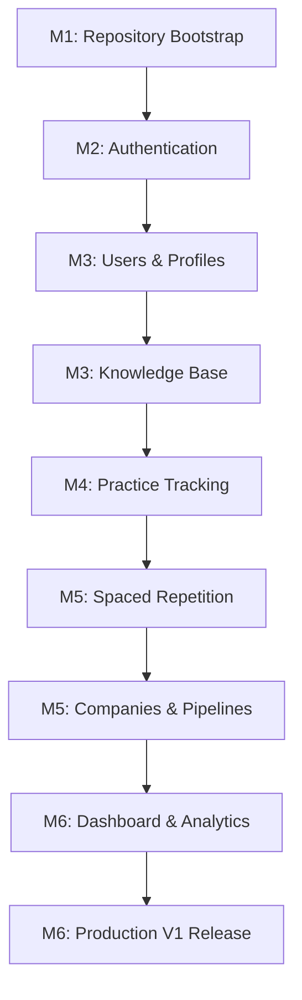

# PlacementOS: Engineering Execution Plan & Backlog
**Document Version:** 1.0.0  
**Status:** Approved  
**Author:** Principal Engineering Manager & Technical Program Manager  

---

## Table of Contents
1. [Project Milestones](#1-project-milestones)
2. [Epics Catalog](#2-epics-catalog)
3. [Features Breakdown](#3-features-breakdown)
4. [User Stories](#4-user-stories)
5. [Engineering Tasks](#5-engineering-tasks)
6. [Task Dependencies](#6-task-dependencies)
7. [Estimated Complexity (Sizing Matrix)](#7-estimated-complexity-sizing-matrix)
8. [Acceptance Criteria](#8-acceptance-criteria)
9. [Definition of Ready (DoR)](#9-definition-of-ready-dor)
10. [Definition of Done (DoD)](#10-definition-of-done-dod)
11. [Risk Assessment](#11-risk-assessment)
12. [Implementation Order](#12-implementation-order)
13. [Sprint Planning](#13-sprint-planning)
14. [Developer Assignment](#14-developer-assignment)
15. [Issue Naming Convention](#15-issue-naming-convention)
16. [GitHub Project Columns](#16-github-project-columns)
17. [Engineering Dashboard Metrics](#17-engineering-dashboard-metrics)
18. [Release Plan](#18-release-plan)
19. [Roadmap Timeline](#19-roadmap-timeline)
20. [Summary](#20-summary)

---

## 1. Project Milestones

The project roadmap maps the path to the V1 production release:

* **Milestone 1: Repository Bootstrap (Week 1–2):** Set up monorepo folders, shared configuration packages, local docker files, linting workflows, and verify compilation.
* **Milestone 2: Authentication & Core security (Week 3–4):** Implement user registration, JWT logins, refresh token rotation, and path authorization checks.
* **Milestone 3: Practice Log & Knowledge Base (Week 5–6):** Support problem logs, attempt history tracking, categories folder navigation, and notes saving.
* **Milestone 4: Spaced Repetition Revision (Week 7–8):** Deploy decay tracking algorithms and scheduled review reminders.
* **Milestone 5: Pipeline & Analytics (Week 9–10):** Build company pipelines, application stage histories, performance stats, and evidence compilation.
* **Milestone 6: V1 Polish & Release (Week 11–12):** Run system penetration checks, verify UI accessibility, and launch the production release.

---

## 2. Epics Catalog

The project backlog is organized into 15 epics:

* `BOOT`: Monorepo initialization and infrastructure tooling.
* `AUTH`: Session management and route protection.
* `USR`: User profiles, settings, and layout density configurations.
* `DASH`: Dynamic widget layout configurations.
* `KNOW`: Knowledge categories and markdown notes.
* `PRACTICE`: Practice problem logs and attempt trackings.
* `REVISION`: Spaced repetition revision queues.
* `COMPANY`: Employer targets tracking.
* `APP`: Job applications stage tracking.
* `EVIDENCE`: Evidence profiles compilation.
* `ANALYTICS`: Performance summaries and history charts.
* `CALENDAR`: Interview schedulers.
* `RESUME`: Resume versions catalog.
* `PROJECT`: Technical projects database.
* `NOTIF`: Alert streams and notifications.

---

## 3. Features Breakdown

Each epic is broken down into specific features:

```
[Epic: AUTH] ──► [Register] ──► [Login] ──► [Refresh Token] ──► [Password Reset]
```

### Epic Breakdown Examples

#### Epic: AUTH (Authentication)
* `AUTH-F1`: User Registration
* `AUTH-F2`: JWT Login & Session Setup
* `AUTH-F3`: Refresh Token Rotation
* `AUTH-F4`: Password Reset Request
* `AUTH-F5`: Global Logouts

#### Epic: PRACTICE (Practice Log)
* `PRAC-F1`: Problem catalog search
* `PRAC-F2`: Log new attempt
* `PRAC-F3`: Add mistake tags

---

## 4. User Stories

User stories describe core features from the user's perspective:

* **US-AUTH-1:** As a student, I want to create an account so that I can track my preparation progress.
* **US-AUTH-2:** As a student, I want to log in securely so that I can access my practice history.
* **US-AUTH-3:** As a student, I want my session to remain active in the background so that I do not have to log in repeatedly.
* **US-PRAC-1:** As a student, I want to log my practice attempts so that I can record my solving times and result status.
* **US-PRAC-2:** As a student, I want to categorize my mistakes using custom tags so that I can focus my revision on weak topics.
* **US-REVI-1:** As a student, I want to view my revision queue so that I can review problems that need practice.

---

## 5. Engineering Tasks

User stories are broken down into specific developer tasks:

### Task Breakdown: US-AUTH-2 (User Login Flow)
1. Create `LoginRequestDto` and Zod validation schema files on the backend.
2. Build `UserRepository.findByEmail` database query methods.
3. Write `PasswordHasher.verify` methods.
4. Build JWT generation utilities to sign access and refresh tokens.
5. Create `AuthController.login` endpoint methods.
6. Configure Express routing entries for `/api/v1/auth/login`.
7. Write unit tests for login controller logic and token validations.
8. Create `useAuth` hooks and Axios interceptors on the frontend.
9. Build the local login form UI.
10. Integrate path protection components.

---

## 6. Task Dependencies

This diagram maps dependencies across the system's development phases:



---

## 7. Estimated Complexity (Sizing Matrix)

Tasks are sized using Fibonacci values and shirt-size metrics:

* **XS (1 Point):** Simple configuration edits or schema updates. Minimal testing required.
* **S (2 Points):** Simple frontend component views or basic database queries.
* **M (3 Points):** Standard feature additions (e.g. adding a controller endpoint, validator schema, and writing basic unit tests).
* **L (5 Points):** Multi-layered feature integrations (e.g. building custom React components, connecting hooks, and writing E2E tests).
* **XL (8 Points):** Core infrastructure integrations (such as implementing token rotation mechanisms, or setting up docker networking configurations).

---

## 8. Acceptance Criteria

Acceptance criteria define specific, testable requirements for user stories:

### Criteria: US-AUTH-2 (Secure User Login)
* **GIVEN** a registered user email and password.
* **WHEN** they submit credentials to `/api/v1/auth/login`.
* **THEN** the API returns HTTP 200 containing a JSON payload with an access token (valid for 15 minutes) and sets a secure, HTTP-only refresh token cookie (valid for 7 days).
* **AND** if invalid credentials are submitted, the API returns HTTP 401 with an `AUTH_FAILED` error code.
* **AND** after 5 consecutive failed login attempts, the API returns HTTP 423 with an `ACCOUNT_LOCKED` code, blocking logins for 15 minutes.

---

## 9. Definition of Ready (DoR)

A backlog task is considered **Ready** to start when:

- [ ] The task has a clear description detailing backend and frontend requirements.
- [ ] Interface changes and API contracts are documented.
- [ ] Task dependencies are resolved.
- [ ] Task complexity is estimated.
- [ ] Measurable acceptance criteria are defined.

---

## 10. Definition of Done (DoD)

A task is considered **Done** when:

- [ ] All code passes TypeScript compiler validations.
- [ ] Unit and integration test suites run successfully.
- [ ] The code is formatted matching Prettier configurations.
- [ ] The feature is reviewed and approved by at least one Tech Lead.
- [ ] Acceptance criteria are verified on local test builds.

---

## 11. Risk Assessment

* **Compromised JWT Tokens:** If an access token is stolen, it remains valid until it expires.
  * *Mitigation:* Limit access token lifetimes to 15 minutes.
* **SQL Query Performance:** Poorly indexed queries could slow down search results as the database grows.
  * *Mitigation:* Enforce index constraints on columns that are queried frequently.
* **Complex Build Tooling:** Monorepos can suffer from slow build times as packages are added.
  * *Mitigation:* Configure Turborepo to cache builds and only run test suites on packages with changes.

---

## 12. Implementation Order

Features are implemented sequentially to ensure a stable build path:

```
[Bootstrap Repo] ➔ [Auth Services] ➔ [Users & Profiles] ➔ [Practice Log] ➔ [Revision Queues] ➔ [Dashboards]
```

1. **Workspace Setup:** Bootstraps folder structures and lint configurations.
2. **Security Foundation:** Implements user models, encryption tools, and API route checks.
3. **Core Features:** Builds practice trackers, knowledge bases, and revision lists.
4. **Integration & Polish:** Builds dashboards, configures analytics dashboards, and runs security tests.

---

## 13. Sprint Planning

Development runs in 2-week sprints:

### Sprint 1: Setup Workspace & Tooling
* Initialize monorepo workspace configurations.
* Set up global linting, prettier configurations, and compiler options.
* Configure development Docker containers.

### Sprint 2: Core Authentication
* Run database migrations for User and RefreshToken models.
* Write password hashing and token generation utilities.
* Implement API login, registration, and logout endpoints.

### Sprint 3: Profiles & Settings
* Build user settings endpoints and layout density models.
* Create frontend layout frameworks (Sidebar, Topbar).
* Integrate route guards and session refresh interceptors.

---

## 14. Developer Assignment

Tasks are assigned by engineering role:

* **DevOps Engineer:** Coordinates repository configuration settings, manages Docker compose files, and sets up CI/CD pipelines.
* **Backend Engineer:** Defines database schemas, writes migration scripts, and builds API services.
* **Frontend Engineer:** Designs UI pages, builds layout components, and connects custom hooks.
* **Full Stack Engineer:** Connects frontend components to API routes, writes validation schemas, and manages state integrations.
* **QA Engineer:** Writes integration test cases, E2E browser tests, and verifies security rules.

---

## 15. Issue Naming Convention

Issues follow standard naming conventions:

* `BOOT-[001-999]` (e.g. `BOOT-001: Configure root pnpm workspace files`).
* `AUTH-[001-999]` (e.g. `AUTH-012: Build refresh token rotation services`).
* `PRAC-[001-999]` (e.g. `PRAC-020: Create problem attempt logging routes`).

---

## 16. GitHub Project Columns

Task statuses are tracked on the project board:

* **Backlog:** Tasks that are scoped but not yet ready to start.
* **Ready:** Tasks that meet the Definition of Ready and can be picked up.
* **In Progress:** Tasks currently being worked on.
* **Review:** Code is written and waiting for PR reviews.
* **Testing:** The feature is being tested by QA engineers.
* **Done:** The task is complete and merged into the main branch.

---

## 17. Engineering Dashboard Metrics

The team tracks performance using these metrics:

* **Open vs. Completed Tasks:** Counts of completed vs. remaining tasks.
* **Test Coverage:** Percentage of code verified by test suites (target: 80%+).
* **Sprint Velocity:** The number of story points completed per sprint.
* **Cycle Time:** The average time it takes for a task to move from In Progress to Done.

---

## 18. Release Plan

* **Alpha Release (Week 8):** Internal testing by the development team. Focuses on core workflows (such as logging attempts).
* **Beta Release (Week 10):** Released to a closed group of users. Focuses on testing spaced repetition features and company trackers.
* **Release Candidate (Week 11):** Verifies bug fixes and runs performance checks on production servers.
* **Production V1 (Week 12):** Public release of the completed application.

---

## 19. Roadmap Timeline

The project roadmap maps the path to the V1 release:

| Week | Milestone | Focus Areas | Deliverables |
| :--- | :--- | :--- | :--- |
| Weeks 1–2 | M1: Bootstrap | Workspace configurations | Initialized monorepo workspace |
| Weeks 3–4 | M2: Auth & Security | Session management | API routes, JWT rotation rules |
| Weeks 5–6 | M3: Core Features | Practice tracking | Practice logs, folder categories |
| Weeks 7–8 | M4: Spaced Repetition | Decay calculations | Spaced repetition revision queues |
| Weeks 9–10| M5: Dashboards | Performance analytics | Analytics charts, company trackers |
| Weeks 11–12| M6: V1 Release | Security & bug fixes | Final production launch |

---

## 20. Summary

```
┌──────────────────────────────────────────────────────────────────────────┐
│                     PlacementOS Backlog Summary                          │
├──────────────────────────────────────────────────────────────────────────┤
│ Cycles: 6 Sprints (12 Weeks total) • Teams: FE, BE, FullStack, DevOps, QA│
│ Milestones: Bootstrap ➔ Auth ➔ Core Features ➔ Spaced Repetition ➔ V1    │
│ Target: 80%+ Test coverage • Verified security configurations            │
├──────────────────────────────────────────────────────────────────────────┤
│                          PLANNING LAWS                                   │
│ 1. Tasks must meet the Definition of Ready before work begins.           │
│ 2. Task sizes are estimated using story points before sprint planning.   │
│ 3. All commits must be linked to a tracked ticket ID.                    │
│ 4. Build pipelines run verification checks on every pull request.        │
│ 5. Code must be approved by a Tech Lead before merging.                  │
│ 6. Core database migrations must be verified before schema changes.      │
└──────────────────────────────────────────────────────────────────────────┘
```

---
*End of Engineering Execution Plan & Backlog.*
