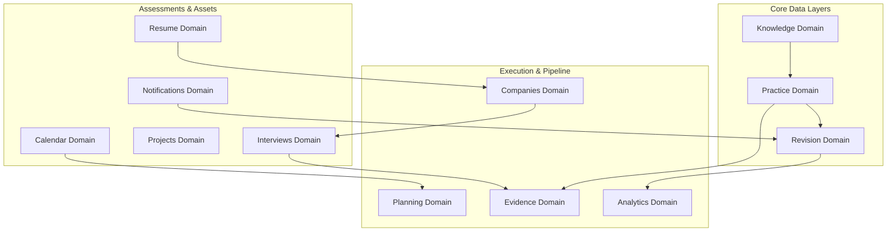

# PlacementOS: Product Requirements Document
## Phase 0: Product Foundation
**Document Version:** 1.0.0  
**Status:** Locked & Approved  
**Target Architecture:** Modular Developer Tool Workspace  

---

## Table of Contents
1. [Executive Summary](#1-executive-summary)
2. [Vision Statement](#2-vision-statement)
3. [Mission Statement](#3-mission-statement)
4. [Problem Statement](#4-problem-statement)
5. [Current Problems Students Face](#5-current-problems-students-face)
6. [Target Audience](#6-target-audience)
7. [Detailed Personas & User Scenarios](#7-detailed-personas--user-scenarios)
8. [User Goals](#8-user-goals)
9. [Business Goals](#9-business-goals)
10. [Product Principles](#10-product-principles)
11. [Core Values](#11-core-values)
12. [Non-Goals](#12-non-goals)
13. [Success Criteria](#13-success-criteria)
14. [Evidence Philosophy](#14-evidence-philosophy)
15. [Metric Philosophy](#15-metric-philosophy)
16. [Product Domains](#16-product-domains)
17. [Feature Prioritization (MoSCoW)](#17-feature-prioritization-moscow)
18. [Assumptions](#18-assumptions)
19. [Risks & Mitigations](#19-risks--mitigations)
20. [Future Scope](#20-future-scope)
21. [Glossary](#21-glossary)
22. [Guiding Rules for Developers](#22-guiding-rules-for-developers)
23. [Architecture Constraints](#23-architecture-constraints)
24. [Documentation Folder Structure](#24-documentation-folder-structure)
25. [Development Roadmap](#25-development-roadmap)
26. [Product Philosophy Summary (One-Page Sheet)](#26-product-philosophy-summary-one-page-sheet)

---

## 1. Executive Summary
PlacementOS is a premium, desktop-grade workspace engineered for software engineering students and professionals preparing for technical recruitment. Designed with the high-density, keyboard-driven aesthetics of modern tools like Linear and Raycast, PlacementOS departs from typical "gamified" learning websites and black-box AI calculators. 

Instead of generating arbitrary "readiness percentages" (e.g., "75% ready for Microsoft"), PlacementOS operates as an **auditable evidence-generation engine**. It centralizes DSA practice tracking, spaced repetition schedules, system design notes, company research, application status, resume iterations, and mock interviews into a single, cohesive, local-first dashboard. The application is built using a highly modular UI system, allowing individual widgets, layouts, and modules to be rearranged or swapped without breaking visual or functional integrity.

---

## 2. Vision Statement
To establish PlacementOS as the standard developer workspace for career readiness, replacing speculative preparation with transparent, evidence-based metrics that developers trust to guide their work and recruiters trust to verify their competence.

---

## 3. Mission Statement
To provide students and professionals with a highly functional, locally persistent, and customizable environment that helps them build, track, and sustain daily preparation habits through verifiable evidence and rigorous feedback loops.

---

## 4. Problem Statement
Technical recruitment preparation is currently fragmented and stressful. Students jump between LeetCode for practice, Notion/Obsidian for notes, Google Sheets for tracking applications, and calendars for mock interview schedules. 

Furthermore, the industry has responded with "AI-driven" platforms that promise predictive readiness scores using opaque, proprietary algorithms. These black-box metrics frequently misguide students—either by inducing false confidence when scores are high or creating severe impostor syndrome when they drop, all without providing actionable diagnostic evidence. There is no single, unified workspace that treats preparation as a disciplined, measurable engineering process.

---

## 5. Current Problems Students Face
* **Information Fragmentation:** Critical notes, code snippets, application logs, and schedules are scattered across multiple tools, leading to cognitive overhead and lost context.
* **Lack of Spaced Repetition:** Students solve hundreds of algorithmic problems but forget the core patterns within weeks because they lack a systematic, automated revision workflow.
* **Opaque and Fake Metrics:** Gamified platforms reward streaks and generic "problem counts" rather than analyzing code accuracy, timing metrics, recurrence of errors, and actual understanding.
* **Uncertainty and Anxiety:** Opaque AI tools present grades and readiness probabilities without transparent proofs, leading to anxiety and lack of direction.
* **No Auditable Portfolio:** Candidates have no verifiable way to present the sheer depth of their preparation—such as mock interview logs, error logs, and time-bound DSA metrics—to external evaluators.

---

## 6. Target Audience
PlacementOS serves five distinct user categories, each presenting unique preparation timelines and constraints:

1. **Second-Year Students (Foundational Prep):** Users focusing on learning fundamentals (Data Structures, Algorithms, Object-Oriented Programming) who need a long-term tracker to log concepts as they acquire them.
2. **Third-Year Students (Intensive Prep & Internships):** Users preparing for immediate internship applications and on-campus recruitments, requiring intense DSA practice, project logs, and initial mock interview systems.
3. **Final-Year Students (Active Placements):** Users actively interviewing who require rapid, high-frequency revision queues, company-specific tracker cards, resume versioning, and real-time application pipelines.
4. **Working Professionals (Career Up-skilling):** Users preparing during off-hours, demanding highly optimized, low-overhead workflows, keyboard shortcuts, and high-density analytics to maximize limited study time.
5. **Career Switchers (Transitioning to tech):** Users from non-CS backgrounds who need structured checklists, clear domain mapping, and foundational metrics to measure their progress against industry standards.

---

## 7. Detailed Personas & User Scenarios

### Persona A: Aarav (2nd Year CS Student)
* **Context:** Aarav wants a head start on placement prep but is easily overwhelmed by the vastness of DSA.
* **Pain Point:** He doesn't know what to track or how to verify that he actually understands a concept.
* **User Scenario:** Aarav opens PlacementOS, adds his first DSA notes under the **Knowledge** domain, logs his initial practice attempts, and sees his "Concept Coverage" grow based on the topics he manually registers.

### Persona B: Simran (3rd Year CS Student)
* **Context:** Simran is targeting top-tier product companies and needs to practice high-level algorithms while maintaining college projects.
* **Pain Point:** She solves 5 problems a day but forgets the patterns of hard tree/graph problems after a month.
* **User Scenario:** PlacementOS flags a set of Graph problems in her **Revision** queue because their "decay score" (based on time since last attempt and previous accuracy) has reached the review threshold. She reviews her custom error notes and re-attempts the problems.

### Persona C: Rahul (Final Year Student)
* **Context:** Rahul is in the middle of placement season and has interviews with three companies next week.
* **Pain Point:** He cannot track which resume version he submitted to which company, and is losing track of interview dates.
* **User Scenario:** Rahul uses the **Companies** CRM board to drag "Company X" to the "Interviewing" stage. The system links his "Resume v2.1" to the card and automatically generates a timeline entry in his **Calendar** domain, prompting him to review Company X's specific question patterns.

### Persona D: Priyanka (Working Professional)
* **Context:** A Backend Engineer with 2 years of experience wanting to switch to a Staff role. She only has 1.5 hours to study each night.
* **Pain Point:** Opaque UI and slow interfaces waste her time; she needs terminal-speed navigation.
* **User Scenario:** Priyanka relies entirely on the **Command Palette (Cmd+K)** to jump between domains, logs problem attempts in under 5 seconds using keyboard shortcuts, and uses the **Analytics** panels to check her solution time vs. historical benchmarks.

### Persona E: Vikram (Career Switcher)
* **Context:** A Mechanical Engineering graduate transitioning into Frontend development.
* **Pain Point:** He lacks a CS degree and needs a structured way to prove his engineering capabilities to recruiters.
* **User Scenario:** Vikram uses the **Evidence** export tool to compile a comprehensive PDF report showing his 200 logged DSA problems, 3 completed system design projects, and 8 logged mock interviews with detailed peer feedback, using it as an attachment for his job applications.

---

## 8. User Goals
* **Establish a Primary Prep Hub:** Have one workspace open every day to manage all preparation tasks.
* **Cure Knowledge Decay:** Retain critical patterns through automated, evidence-backed spaced repetition.
* **Expose Blind Spots:** Easily identify exact problem types, error categories (e.g., off-by-one, time-limit-exceeded), or companies where they are weakest.
* **Document Auditable Proof:** Compile a comprehensive history of metrics, notes, and mocks that cannot be faked or arbitrary.
* **Streamline the Pipeline:** Navigate through schedules, notes, and logs at high speeds using a keyboard-driven UX.

---

## 9. Business Goals
* **Daily Engagement:** Achieve high daily retention rates (DAU/MAU > 50%) by integrating deeply with users' daily study habits.
* **Data Portability & Trust:** Establish the "PlacementOS Log File" (.json export format) as an industry-standard proof-of-preparation file that users can share or showcase.
* **Extensible Ecosystem:** Build a codebase where community developers can write and share custom data scrapers, dashboard widgets, and company guides.
* **Developer Mindshare:** Cultivate a strong reputation in the developer community as the most robust, non-BS utility for career growth.

---

## 10. Product Principles

### I. Evidence over Prediction
We never predict or guess. If a user asks "Am I ready for Google?", we do not show a percentage. We show: *"You have solved 14/20 Google-tagged tree problems with an average solution time of 22 minutes and 90% first-pass accuracy. 3 items in this category are currently due for revision."*

### II. Transparency over AI Magic
Any automated insight or reminder must expose its formula. For example, if a prompt says: "Review Merge Sort Today," it must display a micro-indicator: *"Triggered because: Solved 8 days ago with 'Needs Revision' flag."*

### III. Consistency over Motivation
We design for the long haul. The UI should not badger the user with high-stress red alerts or guilt-inducing streak trackers. It should offer clean, quiet daily lists and historical heatmaps that emphasize long-term consistency.

### IV. Knowledge over Memorization
The workspace must prioritize active recall. When logging problems, the system encourages users to classify *why* they failed (e.g., "Edge case handling," "Incorrect data structure choice") instead of just checking a "Done" box.

### V. Modular Architecture
Every UI view is a widget. The layouts are decoupled. The database models are domain-driven. If a user does not want the "Resume" builder module, they should be able to disable it entirely, and the dashboard will self-arrange without error.

---

## 11. Core Values
* **Integrity:** We display raw, unvarnished stats. If accuracy is 12%, we display 12%.
* **Speed:** The application must load instantly, respond to keystrokes in <50ms, and maintain keyboard layouts for all primary operations.
* **Data Autonomy:** User data belongs to the user. It is stored locally in their PostgreSQL database, with full export capabilities.
* **Utility Density:** No massive whitespace, giant decorative banners, or empty cards. Information is compact, legible, and actionable.

---

## 12. Non-Goals
* **Not a LeetCode Clone:** PlacementOS will not execute or compile code. It is an orchestrator, organizer, and tracker, not an IDE or an online judge.
* **Not an Aesthetic PDF Resume Designer:** We do not compete with tools like Canva. We manage resume *data*, bullet points, impact metrics, and submission logs.
* **Not a Direct Job Board:** We do not scrape job listings or handle application forms natively. We host the pipeline tracking and CRM tools.
* **Not a Social Network:** There are no profiles, feeds, likes, or messaging boards. It is a focused, private workspace.

---

## 13. Success Criteria
* **Engagement Depth:** Users keep the workspace open for >60 minutes on active prep days.
* **System Latency:** UI interactions remain under 100ms; SQL queries return in under 30ms.
* **Spaced Repetition Compliance:** Active users clear >80% of their daily revision queues.
* **Audit Fidelity:** 100% of values displayed on the dashboard can be traced back to SQL database logs via an inspector tool.

---

## 14. Evidence Philosophy
Recruitment preparation platforms are currently built on predictive algorithms. They attempt to mimic interviewers using heuristics, but interviews are highly stochastic, human-driven processes. 

PlacementOS operates on a **flight-log model**. A pilot is certified to fly not because an AI predicts they are 95% ready, but because their flight logbook shows 1,500 hours of documented flight time, including 300 hours in night conditions and 50 hours of instrument-only flight. 

By applying this model to software engineering preparation, PlacementOS builds an indisputable record of:
1. **Clock Time:** Total focused time spent practicing.
2. **Execution Accuracy:** First-pass compilation rates without checking solutions.
3. **Recovery Rate:** Time elapsed between failing a problem and successfully resolving it in revision.
4. **Stress Testing:** Mock interviews conducted under strict time constraints.

This auditable record shifts the user's mind from seeking "motivation" to accumulating "evidence."

---

## 15. Metric Philosophy

```
  ┌─────────────────────────────────────────────────────────────┐
  │                   PlacementOS Metrics                       │
  ├──────────────────────────────┬──────────────────────────────┤
  │      ACCEPTABLE METRICS      │      BANNED METRICS          │
  ├──────────────────────────────┼──────────────────────────────┤
  │ • First-Pass Accuracy        │ • Company Readiness %        │
  │ • Revision Decay Index       │ • Pass Probability %         │
  │ • Solution Time vs. Benchmark│ • Self-Reported Confidence   │
  │ • Error Persistence Rate     │ • Overall "LeetCode" Score   │
  │ • Consistency Metrics        │ • "AI" Talent Rating         │
  └──────────────────────────────┴──────────────────────────────┘
```

### Acceptable Metrics (Auditable & Deterministic)
* **First-Pass Accuracy:** The percentage of problems solved correctly on the first attempt without looking at the editorial.
* **Revision Decay Index:** A mathematical score (based on half-life decay) representing how long it has been since a topic was last practiced, weighted by the difficulty rating.
* **Solution Time vs. Benchmark:** Actual minutes taken to write the solution compared to target interview timings (e.g., 20 mins for Easy, 35 mins for Medium).
* **Error Persistence Rate:** How frequently the same error tag (e.g., "Recursion Stack Overflow") appears across different problem attempts.
* **Consistency Index:** The percentage of active days in a sliding 30-day window.

### Unacceptable Metrics (Banned)
* **Company Readiness Score:** Any percentage indicator predicting readiness for a specific employer (e.g., "Google Readiness: 84%").
* **Pass Probability:** Any forecasting of success (e.g., "90% chance of passing Round 1").
* **Opaque Mastery Grades:** Letters or grades (e.g., "Grade A Array Solver") that do not explicitly link to historical attempts.
* **Self-Reported Confidence Sliders:** Unanchored sliders that rely on user mood rather than objective outcomes.

---

## 16. Product Domains
PlacementOS is organized into 12 core domains. Every view, component, and database model must belong to one of these defined domains:



1. **Knowledge Domain:** Stores user-created conceptual guides, cheat-sheets, structural notes, and curated external learning materials (system design patterns, OS, DBMS).
2. **Practice Domain:** The core problem logbook. Houses individual problem metadata (source URL, difficulty, tags), logs attempts, tracks durations, and classifies errors.
3. **Planning Domain:** Manages milestones, preparation roadmaps, structural checklists, and daily targets.
4. **Revision Domain:** The spaced repetition engine. Uses logs from the Practice Domain to dynamically queue topics, formulas, and problems due for review.
5. **Evidence Domain:** Generates consolidated logs, exports auditable prep history, and packages evidence profiles for external sharing.
6. **Analytics Domain:** Renders performance charts, speed trendlines, accuracy logs, and categorical weakness grids.
7. **Interviews Domain:** Manages mock interviews, registers interviewer feedback, records behavioral answer banks (STAR method), and logs post-interview retrospectives.
8. **Companies Domain:** A CRM-like kanban and list manager for target companies, active applications, recruiter contacts, and custom selection criteria.
9. **Resume Domain:** Houses raw text blocks, bullet points, performance metrics, and history logs of resume revisions, mapping specific versions to job applications.
10. **Projects Domain:** Tracks technical project details, architecture diagrams, deployment checklists, and verified API/performance benchmarks.
11. **Calendar Domain:** The time coordination layer. Displays active interviews, revision slots, milestone deadlines, and mock dates.
12. **Notifications Domain:** System-generated flags highlighting revision decay, scheduling clashes, or incomplete evidence tasks.

---

## 17. Feature Prioritization (MoSCoW)

### Must Have (Phase 1-6)
* Modular Dashboard with drag-and-drop/swappable widget wrappers.
* Practice Log Engine with custom error tagging (e.g., "IndexOutOfBounds", "TLE").
* Spaced Repetition Queue using a deterministic decay algorithm.
* Note-taking editor supporting Markdown inside the Knowledge Domain.
* CRM board for active application tracking (Companies Domain).
* Local PostgreSQL database schema and migrations using Prisma.

### Should Have (Phase 7-10)
* Command Palette (Cmd+K) supporting global search and quick actions.
* Performance Analytics graphs (Solution speed trend, Error frequency charts).
* Mock Interview feedback portal and STAR bank editor.
* Calendar and timeline views showing revision cycles and interviews.
* Version tracking system for resume bullet points.

### Could Have (Phase 11-13)
* Local AI assistant (Ollama/custom API wrapper) to review conceptual notes or mock interview feedback.
* Detailed project architecture designer and checklists.
* System-wide customizable keyboard shortcut config.
* Custom theme generator (JSON style configurations).

### Won't Have (Phase 14+)
* Online code compiler or integrated development sandbox.
* Automatic resume PDF template designs (visual editor).
* Automated direct-to-portal job application bots.

---

## 18. Assumptions
* Users have basic technical knowledge to run local software (PostgreSQL, pnpm, Node).
* Users work primarily on desktop machines or laptops during preparation sessions.
* Data privacy and local database speeds are valued over cloud synchronization.
* Users will record their practice logs truthfully to receive accurate diagnostics.

---

## 19. Risks & Mitigations

| Risk | Impact | Likelihood | Mitigation |
| :--- | :--- | :--- | :--- |
| **Manual Logging Fatigue** | High | High | Design lightweight quick-log forms (<5 seconds) and support raw CSV/JSON imports. |
| **Local Database Loss** | Critical | Low | Provide clear export triggers in the UI to dump full JSON backups to the user's workspace. |
| **Schema Instability** | Medium | Medium | Maintain rigorous Prisma migration files and seed scripts to prevent database breaks. |
| **Complexity Bloat** | High | Medium | Enforce strict domain boundaries; allow users to toggle entire domains off, disabling code paths. |

---

## 20. Future Scope
* **IDE Integrations:** Extensions for VS Code, JetBrains, and Neovim to automatically log problem metadata and solve times.
* **Verified Profiles:** Cryptographically signed exports of PlacementOS preparation logs that candidates can link on portfolios.
* **Community Curated Lists:** An open-source marketplace where users can share study guides, question sheets, and company-specific templates.

---

## 21. Glossary
* **Coverage:** The percentage of required topics within a curriculum that have at least one successfully logged practice attempt.
* **Attempt:** A documented event of solving or trying to solve a problem, recording date, duration, outcome, and notes.
* **Revision:** A structured re-attempt of a previously solved problem triggered by the decay engine.
* **Evidence:** The cumulative, auditable log of attempts, notes, mocks, and projects backing up readiness.
* **Mastery:** A calculated index for a topic based on first-pass accuracy and consistency over time.
* **Practice:** Focused application of knowledge on DSA or conceptual questions.
* **Consistency:** The ratio of active days to total days over a rolling monthly window.
* **Confidence:** The user's historical accuracy rate under time constraints (not a self-declared value).
* **Weakness:** A topic or tag showing accuracy below 60% or solve times consistently above benchmark limits.
* **Insight:** A deterministic conclusion drawn from logs (e.g., *"Tree problems take 40% longer than your average Medium problem"*).
* **Recommendation:** An actionable next step generated by clear rules (e.g., *"Revise Heap Sort today because it hasn't been practiced in 14 days and has a 50% accuracy rate"*).

---

## 22. Guiding Rules for Developers
1. **Zero Fake Numbers:** Do not write any code that estimates, predicts, or scores a user's probability of success without a public, explainable algorithm.
2. **Domain Isolation:** A component inside `/src/domains/knowledge` must never import directly from `/src/domains/resume`. All inter-domain communications must happen via explicit APIs, Contexts, or State Stores.
3. **Keyboard Accessibility:** Every primary action (creating logs, opening search, switching tabs) must have a designated keyboard shortcut.
4. **No Opaque AI Calls:** Any feature utilizing LLMs must display the raw prompt and system instructions to the user on request.
5. **Strict Local Persistence:** All application states must persist to the local PostgreSQL instance. No cloud connections are permitted without explicit user configuration.

---

## 23. Architecture Constraints
* **Monorepo / Clean Boundaries:** Separate Frontend (`/frontend`) and Backend (`/backend`) layers.
* **State Management:** Use Zustand for global UI state; TanStack Query for caching and syncing database data.
* **CSS Framework:** Tailwind CSS v4 only. Custom utilities must be declared in CSS variable sheets.
* **Type Safety:** 100% TypeScript compile-time checks. Strict Zod validations on all API boundaries and forms.
* **Prisma Schema:** Maintain highly normalized relational database structures with appropriate foreign keys and indexes.

---

## 24. Documentation Folder Structure
All project documentation must be organized using the following system:

```text
/docs
├── /architecture
│   ├── system_architecture.md     # General ERN overview & communication
│   ├── database_schema.md         # Prisma & PostgreSQL details
│   └── state_management.md        # Zustand & TanStack Query patterns
├── /domains
│   ├── 01_knowledge.md
│   ├── 02_practice.md
│   ├── 03_revision.md
│   └── [other_domains].md
├── /guides
│   ├── onboarding.md              # Local setup & seeding
│   ├── coding_standards.md        # ESLint & Prettier rules
│   └── deployment.md              # Production build guidelines
└── roadmap.md                     # Phase timeline and tracking
```

---

## 25. Development Roadmap
The project will advance through 15 structured phases:

* **Phase 0: Product Foundation** *(This Document)* — Define PRD, Tech Stack, and Design System Principles.
* **Phase 1: Design System & UI Architecture** — Establish color tokens, atomic widgets, layout systems, and command palette.
* **Phase 2: Database Architecture** — Define Prisma Schema, build seeds, and verify local PostgreSQL migrations.
* **Phase 3: Authentication & User System** — Local JWT login, bcrypt security, and workspace isolation.
* **Phase 4: Knowledge Engine** — Implement Markdown notes, categorizations, and cheat-sheet blocks.
* **Phase 5: Preparation Engine** — Build the Practice Log dashboard, problem creators, and attempt logs.
* **Phase 6: Evidence Engine** — Implement the evidence log exporter and auditable detail viewer.
* **Phase 7: Analytics** — Integrate charts showing solve times, accuracy trends, and error heatmaps.
* **Phase 8: Company Intelligence** — Develop the CRM kanban board and application tracking workflows.
* **Phase 9: Calendar & Planner** — Build scheduling blocks, interview timelines, and daily study plans.
* **Phase 10: Revision Engine** — Integrate the spaced repetition decay algorithm and dashboard queues.
* **Phase 11: Interview Module** — Implement Mock Interview feedback logs and STAR method editors.
* **Phase 12: Resume Module** — Setup bullet point tracking, version histories, and application maps.
* **Phase 13: AI Assistant** — Add opt-in local Ollama/OpenAI API integrations for conceptual reviews.
* **Phase 14: Polish & Production** — Complete full end-to-end testing, ESLint validation, performance tweaks, and seed finalizing.

---

## 26. Product Philosophy Summary (One-Page Sheet)

### The PlacementOS Manifesto
> **We build workspaces, not playgrounds. We write logs, not predictions.**

1. **You are the pilot.** Your preparation is logged like hours in a flight cockpit. You are ready when the numbers show you can handle the flight, not when an algorithm guesses you can.
2. **Details are dense.** A professional tool shows you your speed, your errors, your recurrences, and your decay. It does not hide information behind shiny progress bars.
3. **Local first, local last.** Your career data is your private IP. It sits on your machine, in your database, under your control.
4. **Consistency is silent.** We do not send you motivational emails or spam you with fire emojis. We give you a command palette, a keyboard layout, and a revision queue. The rest is up to you.

---
*End of Phase 0 Product Foundation document.*
