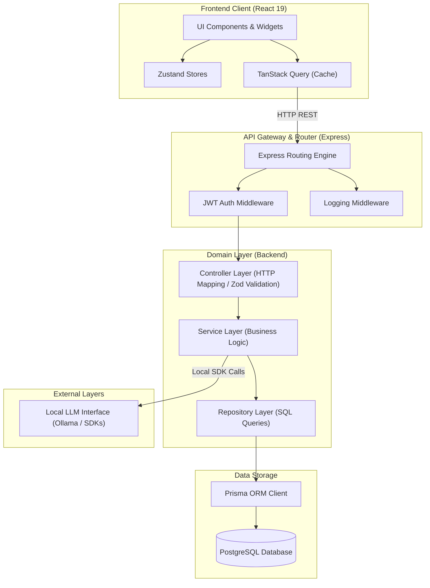

# PlacementOS: Software Architecture Document
## Phase 1: Design System & UI Architecture Setup
**Document Version:** 1.0.0  
**Status:** Approved  
**Author:** Principal Software Architect  

---

## Table of Contents
1. [Architecture Overview](#1-architecture-overview)
2. [High-Level System Diagram](#2-high-level-system-diagram)
3. [Architectural Principles](#3-architectural-principles)
4. [Module Breakdown](#4-module-breakdown)
5. [Folder Structure](#5-folder-structure)
6. [Request Lifecycle](#6-request-lifecycle)
7. [Backend Layer Responsibilities](#7-backend-layer-responsibilities)
8. [Frontend Layer Responsibilities](#8-frontend-layer-responsibilities)
9. [Dependency Rules](#9-dependency-rules)
10. [Cross-Cutting Concerns](#10-cross-cutting-concerns)
11. [Scalability Strategy](#11-scalability-strategy)
12. [Testing Strategy](#12-testing-strategy)
13. [Coding Standards](#13-coding-standards)
14. [Error Handling Strategy](#14-error-handling-strategy)
15. [Configuration Management](#15-configuration-management)
16. [Security Considerations](#16-security-considerations)
17. [Performance Considerations](#17-performance-considerations)
18. [Extension Strategy](#18-extension-strategy)
19. [Architecture Decision Records (ADRs)](#19-architecture-decision-records-adrs)
20. [Summary (One-Page Architecture Sheet)](#20-summary-one-page-architecture-sheet)

---

## 1. Architecture Overview

PlacementOS is structured as a **Modular Monolith** using the **ERN Stack** (Express, React, Node.js) with a strict implementation of **Domain-Driven Design (DDD)** and the **Repository Pattern**. 

```
┌────────────────────────────────────────────────────────┐
│                        React UI                        │
├────────────────────────────────────────────────────────┤
│                       Controller                       │
├────────────────────────────────────────────────────────┤
│                        Service                         │
├────────────────────────────────────────────────────────┤
│                       Repository                       │
├────────────────────────────────────────────────────────┤
│                         Prisma                         │
├────────────────────────────────────────────────────────┤
│                       PostgreSQL                       │
└────────────────────────────────────────────────────────┘
```

### Architectural Decisions & Trade-offs

#### Why ERN?
* **Unified Language (TypeScript):** Single type definition ecosystem across frontend client, backend controllers, validation boundaries (Zod), and database layers (Prisma).
* **Developer Ecosystem:** Extensive package availability for developer utilities (e.g., markdown parsing, scheduling, formatting).
* **Local Hosting Simplicity:** Running a Node.js API server and React client locally is low-friction and consumes minimal desktop resources.

#### Why Domain-Driven Design (DDD)?
* **Feature Isolation:** Rather than placing all controllers in a generic controllers folder, all logic belonging to `practice` is grouped together. This ensures that features can be enabled, disabled, or removed completely by simply managing folder trees.
* **Bounded Contexts:** Each domain owns its explicit models, validators, and logic, preventing feature bleeding.

#### Why the Repository Pattern?
* **ORM Abstraction:** Direct database access inside services couples business rules to Prisma query syntax. Wrapping queries inside repository classes ensures that the business layer remains database-agnostic.
* **Test Mockability:** Services can be unit tested without starting a database container by passing mock repository classes implementing defined interfaces.

#### Layered Architecture Trade-offs
* **Cost:** Increased boilerplate files (DTO, Controller, Service, Repository for a simple CRUD operation).
* **Benefit:** 10-year codebase longevity, zero spaghetti code, high testing coverage, and clean structural separation of responsibilities.

---

## 2. High-Level System Diagram

The system diagram below illustrates the clean separation of layers and the unidirectional flow of requests from the user interface down to the database, alongside cross-cutting concerns:



---

## 3. Architectural Principles

PlacementOS is designed according to these core engineering rules:

* **SOLID Design Patterns:**
  * *Single Responsibility Principle (SRP):* A controller only handles HTTP parsing/response mapping. A service only contains business rules. A repository only runs database queries.
  * *Dependency Inversion Principle (DIP):* High-level business modules do not import low-level database connectors directly; they consume abstractions provided by repositories.
* **Feature Isolation:** No database-level relationships should force cross-domain service imports unless absolutely necessary. Inter-module cooperation occurs strictly at the service-to-service interface level.
* **Composition over Inheritance:** UI elements and backend utilities are built by composing small, modular functions/components rather than extending broad base classes.
* **Convention over Configuration:** Folder hierarchies, file names, API path naming conventions, and parameter configurations are strictly standard to make the application instantly navigable for new developers.
* **Separation of Concerns (SoC):** Distinct modules maintain strict limits. The presentation layer (React) contains zero business validation or raw SQL logic; data layers contain zero UI considerations.

---

## 4. Module Breakdown

Every aspect of PlacementOS is isolated into modules. The table below lists each module's purpose, boundaries, and dependencies:

| Module Name | Core Purpose | Primary Responsibilities | Direct Dependencies | Future Scalability |
| :--- | :--- | :--- | :--- | :--- |
| **Authentication** | Manage session states | JWT signing, credential checks, password hashing | Users | OAuth integrations, biometric local keys |
| **Users** | User Profile administration | User registration, password resets, baseline configurations | None | Multi-tenant profile accounts |
| **Dashboard** | Orchestrate dashboard view | Arrange visual widgets, coordinate drag-and-drop actions | Settings | Custom layouts saved in DB |
| **Knowledge** | Support study resource records | Markdown storage, concept indexing, folder maps | Users | Version history trees |
| **DSA** | Algorithmic curriculum index | Static tracking of standard problem sheets (Striver, Blind75) | None | Custom list parser imports |
| **Practice** | Track coding problem solving | Log solve times, record compilation errors, track links | Users, DSA | IDE plugins syncing logs automatically |
| **Revision** | Manage spaced repetition | Calculate item decay half-lives, queue review cards | Practice | Advanced machine-learning spacing |
| **Evidence** | Compile proof-of-prep | Compile audit log outputs, export summaries as PDF/JSON | Practice, Interviews | Cryptographic signing of export logs |
| **Analytics** | Render user metrics | Generate speed charts, calculate accuracy indexes | Practice, Revision | Custom analysis dashboards |
| **Companies** | CRM pipeline for job hunt | Track recruitment stages (Kanban), log company research | Users | Recruiter portal integrations |
| **Resume** | Draft CV bullet points | Track versions of descriptions, map iterations to applications | Companies | Automated tailoring prompts |
| **Calendar** | Manage preparation dates | Coordinate schedules for reviews, log interview events | Planning | Google Calendar / Outlook sync |
| **Interview** | Register feedback, STAR banks | Log mock runs, save STAR answers, store feedback grids | Companies | Voice-to-text auto feedback analyzer |
| **Notifications**| Raise system warnings | Alert users of pending revision decay or schedule conflicts | Users | OS-native push alerts |
| **Settings** | Control configurations | Adjust application properties, theme settings | Users | Global sync config setups |
| **Notes** | Free-form note editor | General text entry, quick scribbles | Users | Graph-based note linking |
| **Projects** | Document software project builds | Track deployment checklists, document architectures | Users | Automated Git commit tracking hooks |
| **AI Assistant** | Local AI processing | Wrap local LLM prompts, coordinate mock interviews | Notes, Practice | Agentic chat systems |

---

## 5. Folder Structure

The PlacementOS repository is organized as a unified monorepo with clear, feature-first boundaries between the client frontend and database API backend.

```text
/workspace
├── /frontend
│   ├── /public
│   ├── /src
│   │   ├── /components         # Shared UI primitives (Buttons, Inputs, Dialogs)
│   │   ├── /domains            # Feature-first frontend modules
│   │   │   ├── /auth
│   │   │   │   ├── /components # Auth-specific components
│   │   │   │   ├── /hooks      # Auth hooks (useLogin, useRegister)
│   │   │   │   └── /stores     # Auth state stores (Zustand)
│   │   │   └── /practice
│   │   │       ├── /components # Practice-specific widgets
│   │   │       ├── /hooks      # TanStack Query mutations
│   │   │       └── /stores     # Component placement configuration
│   │   ├── /hooks              # Shared cross-domain React hooks
│   │   ├── /lib                # Third-party instance configs (Axios, QueryClient)
│   │   ├── /routes             # React Router v7 routes
│   │   ├── /theme              # CSS Design variables (Tailwind CSS v4)
│   │   ├── App.tsx             # Root layout mounting point
│   │   └── main.tsx            # DOM initialization entry
│   ├── package.json
│   ├── tsconfig.json
│   └── vite.config.ts
├── /backend
│   ├── /prisma
│   │   ├── schema.prisma       # Database design definitions
│   │   ├── migrations/         # PostgreSQL structure logs
│   │   └── seed.ts             # Default mock datasets generator
│   ├── /src
│   │   ├── /config             # Environment setups and system parameters
│   │   ├── /middlewares        # Shared Express middlewares (Auth, Pino Logger)
│   │   ├── /shared             # Global interfaces, common errors, utility helpers
│   │   ├── /domains            # Feature-first backend modules
│   │   │   ├── /auth
│   │   │   │   ├── auth.controller.ts
│   │   │   │   ├── auth.service.ts
│   │   │   │   └── auth.validator.ts
│   │   │   └── /practice
│   │   │       ├── practice.controller.ts
│   │   │       ├── practice.service.ts
│   │   │       ├── practice.repository.ts
│   │   │       ├── practice.validator.ts
│   │   │       └── practice.dto.ts
│   │   └── server.ts           # Server start configuration file
│   ├── package.json
│   └── tsconfig.json
├── package.json                # Monorepo workspaces coordinator
└── pnpm-workspace.yaml
```

---

## 6. Request Lifecycle

The diagram below details the sequence of a typical request, tracking a user action from the React UI down to the database:

```
[User Action] ──> [React Frontend] ──> [Axios/Fetch Request] ──> [Express Router]
                                                                        │
[Zod Validation] <── [Express Controller] <── [JWT Middleware] <────────┘
        │
        └──> [Service Layer] ──> [Repository Layer] ──> [Prisma Client] ──> [PostgreSQL]
                                                                                  │
[React Render] <── [Zustand/Query Cache] <── [JSON Response 200] <────────────────┘
```

1. **User Interaction:** The user inputs details into a form (e.g., logging a solved problem) and clicks "Save Attempt."
2. **Frontend State & API Dispatch:** React triggers a TanStack Query mutation which coordinates an Axios POST call to `/api/v1/practice/attempts`.
3. **Routing & Authentication:** Express routes the incoming request through global middlewares (validating JWT tokens and logging connection context via Pino).
4. **Controller Routing & Validation:** The target `PracticeController` maps the request, invoking a Zod parser to validate request payloads against strict DTO boundaries.
5. **Business Logic Execution:** The validated payload enters `PracticeService.logAttempt()`. The service calculates the revision decay half-life and marks the problem status.
6. **Database Operation:** The service invokes the `PracticeRepository.save()` interface. The repository maps the internal entities to database queries using Prisma Client.
7. **Database Persistence:** PostgreSQL executes the query, persisting the transaction, and returns the persisted record.
8. **Propagation & Update:** The data flows back up through the layers. The controller returns a structured JSON payload to the client, which invalidates related TanStack queries, triggering automatic UI updates.

---

## 7. Backend Layer Responsibilities

```
┌────────────────────────────────────────────────────────┐
│                      Controllers                       │
│    (Handles HTTP Parsing, Headers, Status Mapping)     │
└──────────────────────────┬─────────────────────────────┘
                           ▼
┌────────────────────────────────────────────────────────┐
│                        Services                        │
│   (Business Logic, Transaction Management, Validation) │
└──────────────────────────┬─────────────────────────────┘
                           ▼
┌────────────────────────────────────────────────────────┐
│                      Repositories                      │
│        (Database Access, Raw Queries, SQL mappings)    │
└────────────────────────────────────────────────────────┘
```

* **Controllers:** Exclusively responsible for handling incoming HTTP requests. They parse routing tokens, extract headers, run Zod validations, pass execution parameters to services, and map service output to appropriate HTTP status codes (200, 201, 400, etc.). No business logic or SQL queries belong in this layer.
* **Services:** The core transactional engine where business logic resides. Services perform validations, fetch data from multiple repositories, trigger notifications, interface with system helpers, and orchestrate processing logic.
* **Repositories:** Manage data storage communication. All database queries must be written in repository files, isolating Prisma logic completely from business flows.
* **DTOs & Validators:** DTOs represent incoming data shapes. Validators use Zod schemas to ensure no malicious, incomplete, or malformed data bypasses API boundaries.
* **Middlewares:** Implement interceptors for tasks like CORS config, JWT parsing, rate limiting, and request tracing.
* **Shared, Config & Utilities:** Config handles system environment files. Utilities provide common helpers (e.g., date calculations, string formatters).

---

## 8. Frontend Layer Responsibilities

* **Pages:** Map directly to application routes. They act as wrappers, coordinating state configurations, and positioning primary layout grids.
* **Layouts:** Persistent visual components (e.g., Sidebar wrappers, Dashboard shells) that define grid architectures and route outlet view frames.
* **Components:** Small, reusable UI controls (e.g., `<Button>`, `<Input>`, `<Dialog>`). They contain zero domain business rules.
* **Widgets:** Complex, domain-specific UI components (e.g., `<SpacedRepetitionQueue>`, `<ProblemLoggerCard>`). They bind directly to domain stores or API queries.
* **Hooks:** Custom React lifecycle controls (e.g., `usePracticeHistory`) mapping API requests to TanStack Query caches.
* **Stores:** State engines managed by Zustand for transient, UI-specific parameters like current theme configs, sidebar states, and active layout structures.
* **API / Services:** Module-bound Axios client files defining network requests to the backend server.
* **Theme:** Global Tailwind CSS variables defining colors, spaces, typography, and standard transition schedules.

---

## 9. Dependency Rules

```
┌─────────────────┐
│     Client      │
└────────┬────────┘
         │ (HTTP REST API Only)
         ▼
┌─────────────────┐
│   Controllers   │
└────────┬────────┘
         │
         ▼
┌─────────────────┐
│    Services     │◄─── (Cross-domain calls allowed only here)
└────────┬────────┘
         │
         ▼
┌─────────────────┐
│  Repositories   │
└────────┬────────┘
         │
         ▼
┌─────────────────┐
│  Database Layer │
└─────────────────┘
```

### Dependency Guardrails
* **No Direct DB Calls from Controllers:** Database queries must never bypass the Service and Repository layers.
* **No Repository-to-Repository Imports:** A repository cannot run queries across database scopes outside its boundary.
* **Strict Unidirectional Flow:** Code must only call downward. Repositories must never access services; services must never access controllers.
* **Cross-Domain Communication Boundaries:** A controller belonging to the `Companies` domain must never invoke a service belonging to the `Resume` domain. Cross-domain interactions occur strictly within the Service Layer:

```
[CompaniesController] ──> [CompaniesService] ──> [ResumeService] ──> [ResumeRepository]
```

---

## 10. Cross-Cutting Concerns

Cross-cutting concerns are organized globally, preventing code duplication across domain directories:

* **Authentication:** A global middleware intercepts routes, reads JWT authorization headers, decrypts the payload, and attaches the parsed user object to the request context.
* **Authorization:** Role check decorators or helper logic inside route parameters prevent unauthorized queries (e.g., verifying user access rights to specific resource blocks).
* **Validation:** All external data models are parsed against defined Zod validator classes before executing database writes.
* **Logging:** Pino logs request durations, tracking user actions via a unique request identifier (correlation ID).
* **Error Handling:** System failures map to typed custom error classes. A centralized Express error middleware interceptor formats failures into standardized JSON responses, shielding users from raw stack traces.
* **Rate Limiting:** Protects key endpoints (e.g., login, password resets) from automated brute-force attacks.
* **Configuration:** Centralized environmental variable verification checks validate configurations on application startup.

---

## 11. Scalability Strategy

PlacementOS is structured to evolve alongside user needs, providing a clear path from a local development environment to a containerized deployment:

```
[Modular Monolith] ──> [Docker Containers] ──> [Background Queues] ──> [Microservices]
```

1. **Phase 1: Local Development Monolith (Current):** Single Node API server and client React app connecting to local PostgreSQL. Ideal for fast setup, low resource footprint, and easy local backups.
2. **Phase 2: Containerization (Docker):** Standardize environments via `Dockerfile` and `docker-compose.yml`, decoupling the web client, API server, and PostgreSQL database instance.
3. **Phase 3: Background Worker Integration:** Introduce Redis and BullMQ queues to handle tasks like automated backup generations, heavy report compilations, and spaced-repetition logic outside the main thread.
4. **Phase 4: Cloud & Service Extraction:** When scaling to multiple users, deploy the API to AWS ECS, utilize AWS RDS for PostgreSQL database persistence, and break heavy domains (like the AI Assistant or Evidence compilations) into independent microservices.

---

## 12. Testing Strategy

```
┌────────────────────────────────────────────────────────┐
│                     E2E (Playwright)                   │
│               - Tests complete user journeys           │
├────────────────────────────────────────────────────────┤
│                 Integration (Supertest)                │
│               - Tests API endpoint routes              │
├────────────────────────────────────────────────────────┤
│                     Unit (Vitest)                      │
│               - Tests business logic & helpers         │
└────────────────────────────────────────────────────────┘
```

* **Unit Testing (Vitest):** Core target: Service layers and helper functions. Repositories are mocked, allowing verification of business logic paths without running a database.
* **Integration Testing (Supertest):** Verifies Express controllers, validation boundaries, and ORM database interfaces against a real, local PostgreSQL testing instance.
* **End-to-End Testing (Playwright):** Simulates user flows in actual headless browser scenarios (e.g., logging in, solving a question, verifying the dashboard charts update).
* **Code Coverage Goal:** Minimum **80% code coverage** across all service files.

---

## 13. Coding Standards

### Naming Conventions
* **Directories:** Always use lowercase with hyphens (e.g., `practice-log`, `spaced-repetition`).
* **Source Files:**
  * React Components: PascalCase (e.g., `DashboardWidget.tsx`).
  * Hooks: prefix with `use`, camelCase (e.g., `usePracticeHistory.ts`).
  * Backend Source Files: camelCase with category suffix (e.g., `practice.controller.ts`, `auth.service.ts`).
* **Variables & Functions:** Always camelCase (e.g., `const userAttemptCount = 5;`, `function calculateDecayRate()`).
* **Constants:** UPPER_SNAKE_CASE (e.g., `const REVISION_INTERVAL_DAYS = 3;`).
* **Interfaces & Types:** PascalCase. Interfaces must start with `I` (e.g., `interface IPracticeAttempt`), while types must be descriptive (e.g., `type AttemptStatus = 'PASS' | 'FAIL'`).
* **Enums:** PascalCase for enum name and UPPER_SNAKE_CASE for values.

---

## 14. Error Handling Strategy

Centralized error handling is implemented by extending the native JavaScript `Error` class, capturing system exceptions and translating them into structured, actionable JSON payloads:

```text
               ┌───────────────┐
               │  System Error │
               └───────┬───────┘
                       ▼
            ┌─────────────────────┐
            │  Global Error Route │
            └──────────┬──────────┘
                       ▼
            ┌─────────────────────┐
            │ Standard JSON Parse │
            └─────────────────────┘
```

### Centralized Exception Wrapper
```typescript
export class AppError extends Error {
  constructor(
    public readonly statusCode: number,
    public readonly errorCode: string,
    message: string,
    public readonly details: any = null
  ) {
    super(message);
    Object.setPrototypeOf(this, new.target.prototype);
  }
}
```

### Standardized Error API Response Format
```json
{
  "success": false,
  "error": {
    "code": "VALIDATION_FAILED",
    "message": "The request body failed to pass schema rules.",
    "details": [
      {
        "field": "durationMinutes",
        "issue": "Expected number, received string"
      }
    ]
  }
}
```

---

## 15. Configuration Management

Environment variables are validated on start using Zod. This prevents the application from booting if critical keys are missing:

```typescript
import { z } from 'zod';
import dotenv from 'dotenv';

dotenv.config();

const envSchema = z.object({
  NODE_ENV: z.enum(['development', 'production', 'test']).default('development'),
  PORT: z.string().transform(Number).default('4000'),
  DATABASE_URL: z.string().url(),
  JWT_SECRET: z.string().min(32),
  LOG_LEVEL: z.enum(['info', 'debug', 'warn', 'error']).default('info')
});

const parsed = envSchema.safeParse(process.env);

if (!parsed.success) {
  console.error("❌ Configuration validation failed:", parsed.error.format());
  process.exit(1);
}

export const Config = parsed.data;
```

---

## 16. Security Considerations

PlacementOS implements industry-standard security practices to protect user data and ensure secure communication:

* **Session Validation (JWT):** Sessions use secure JSON Web Tokens signed with HS256. They contain a short expiration window (e.g., 2 hours).
* **Password Security:** Passwords are hashed using `bcrypt` with a work factor of 12 rounds before database storage.
* **HTTP Headers Protection (Helmet):** Helmet is mounted in Express to set secure HTTP headers (protecting against clickjacking, sniff attacks, and cross-site scripting).
* **CORS Settings:** Configured to reject all request origins except the designated local frontend port.
* **Database Guardrails (SQL Injection):** Prisma ORM handles parameterization natively, ensuring database queries are safe.
* **Cross-Site Scripting (XSS):** Markdown parsers sanitize content, protecting dashboard outputs from script injection.
* **Cross-Site Request Forgery (CSRF):** The API validates JWTs stored in request headers rather than cookies, mitigating CSRF attacks.
* **Secret Management:** Sensitive keys are never committed to version control. They are managed through locally stored `.env` files.

---

## 17. Performance Considerations

* **Cursor-Based Pagination:** Database queries for high-volume logs (such as practice histories) use cursor pagination, maintaining low search latencies as the database grows.
* **Index Configuration:** Fields that are queried frequently (e.g., `userId`, `attemptDate`, `status`, and `companyId`) are indexed in the schema.
* **Client-Side Caching (TanStack Query):** Caches API data on the client side, eliminating redundant HTTP calls.
* **Lazy Loading:** Frontend routes are loaded lazily, optimizing bundle size and initial load speeds.
* **React Memoization:** High-density analytics panels use `useMemo` to prevent unnecessary component re-renders.
* **Optimistic Updates:** The UI updates state stores immediately on action (e.g., toggling a task checkbox) and syncs with the database in the background, keeping the user experience responsive.

---

## 18. Extension Strategy

To add a new feature (e.g., a "Mock Exams" tracker) without affecting existing code, follow these steps:

```text
┌────────────────────────────────────────────────────────┐
│ 1. Create Model ──> 2. Build Repository ──> 3. Service  │
├────────────────────────────────────────────────────────┤
│ 4. Controller ──> 5. Mount Router ──> 6. UI Component  │
└────────────────────────────────────────────────────────┘
```

1. **Define Schema:** Add the `MockExam` model to `schema.prisma` and run `npx prisma migrate dev` to update the database.
2. **Build Repository:** Create `mock-exam.repository.ts` in `/backend/src/domains/mock-exam` to handle database operations.
3. **Implement Service:** Create `mock-exam.service.ts` to manage business logic.
4. **Implement Controller & Validator:** Write `mock-exam.controller.ts` and define input schemas using Zod.
5. **Mount Router:** Register the new controller routes in `server.ts` under `/api/v1/mock-exams`.
6. **Implement UI Component:** Add the feature to `/frontend/src/domains/mock-exam`, creating related components and stores, then mount the view as a widget on the main dashboard.

---

## 19. Architecture Decision Records (ADRs)

### ADR-001: Local PostgreSQL Storage for Development
* **Status:** Approved
* **Context:** The application requires high-density relational queries (spaced repetition scheduling, analytics, company logs).
* **Decision:** We will use a local installation of PostgreSQL managed via Prisma migrations, rather than SQLite or a cloud database.
* **Rationale:** Relational data structures, type-safe transactions, and fast query execution are essential. Storing data locally protects user privacy and ensures low latency.
* **Trade-offs:** Users must have a local PostgreSQL instance running to develop or run the application.

### ADR-002: Domain-Driven Feature Folder Monolith
* **Status:** Approved
* **Context:** Typical monorepos can suffer from code coupling, making it difficult to refactor or remove features.
* **Decision:** Enforce a strict Domain-Driven folder structure where each domain owns its controllers, services, repositories, and UI widgets.
* **Rationale:** Groups related logic together. Developers can add, edit, or remove features within a single directory, maintaining codebase health.
* **Trade-offs:** Adds file hierarchy depth and requires strict enforcement of dependency boundaries.

### ADR-003: Zustand for Frontend State Management
* **Status:** Approved
* **Context:** The frontend needs to manage global UI configurations, theme states, drag-and-drop layouts, and transient alerts.
* **Decision:** Use Zustand for client state management, while relying on TanStack Query for server state caching.
* **Rationale:** Zustand is a lightweight, hook-based state manager that avoids the boilerplate of Redux and the re-render performance issues of React Context.
* **Trade-offs:** Does not have standard Redux-like centralized state history tools, but is ideal for a fast, responsive UI.

---

## 20. Summary (One-Page Architecture Sheet)

```
┌──────────────────────────────────────────────────────────────────────────┐
│                          PlacementOS Architecture                        │
├──────────────────────────────────────────────────────────────────────────┤
│ Stack: React 19 • Vite • TypeScript • Tailwind v4 • Express • Prisma • PG │
│ Architecture: Modular Monolith with Domain-Driven Folder Layout          │
│ Patterns: Repository Pattern • Controller-Service-Repository Separation   │
├──────────────────────────────────────────────────────────────────────────┤
│                          CORE ARCHITECTURE RULES                         │
│ 1. Code flows downstream only: Controller ─► Service ─► Repository       │
│ 2. Cross-domain interactions occur strictly within the Service Layer.    │
│ 3. Database queries must be written in repositories, never in services.  │
│ 4. No arbitrary mock scores. All metrics must be explainable from logs.  │
│ 5. Every endpoint must validate payloads using Zod validators.           │
│ 6. App state is stored locally in PostgreSQL, keeping user data private.  │
└──────────────────────────────────────────────────────────────────────────┘
```

---
*End of Phase 1 Software Architecture Document.*
