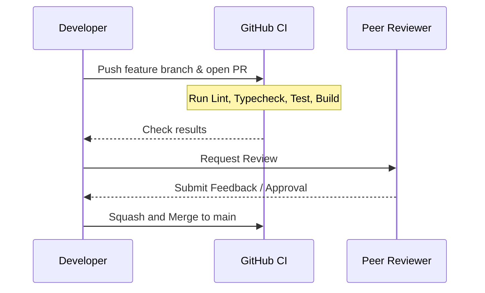

# Development Workflow: PlacementOS

This document specifies the development processes, branching strategies, and release rules.

---

## 🌿 Branching Strategy & Git Flow

We follow a modified Git Flow model centered around safety and fast delivery.

```
                  [release/v1.0] ----> tag: v1.0.0
                        ^
                        | (release branch)
[main] -----------------------------------------------> (production stable)
  ^
  | (merge pull request)
[feature/AUTH-001] ----> [feature/AUTH-002] ---> (active coding branch)
```

1. **`main` Branch:**
   * Contains production-stable code.
   * All commits to `main` must pass tests, linting, and manual code reviews.
2. **Feature Branches (`feature/*`):**
   * Cut from `main`.
   * Format: `feature/<task-id>-<short-description>` (e.g., `feature/AUTH-001-jwt-session`).
3. **Bugfix Branches (`bugfix/*`):**
   * Cut from `main` or release branches.
   * Format: `bugfix/<task-id>-<description>` or `bugfix/<description>`.

---

## 🔀 Merge & Release Strategy

### Merge Rules
* **No Direct Pushes:** All changes must go through Pull Requests.
* **Squash and Merge:** We default to Squash and Merge to keep history clean.
* **Checks Passed:** CI check (lint, typecheck, test, build) is mandatory.

### Tag Strategy
* Release tags are created on `main` using Semantic Versioning.
* Format: `v<Major>.<Minor>.<Patch>` (e.g. `v1.0.0`).
* Alpha and Beta releases: `v1.0.0-alpha.1`.

---

## 📝 Pull Request & Review Workflow



1. **Lint and Typecheck:** Must pass before requesting review.
2. **Review:** At least 1 approval is required from a senior engineer.
3. **Definition of Done:** Ensure code passes the DoD before merging.
