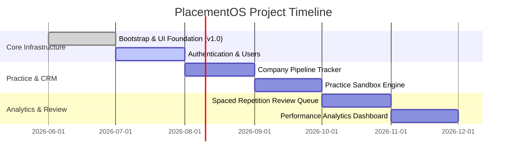

# Roadmap: PlacementOS

This document outlines the product roadmap for PlacementOS. It is divided into completed foundations, current priorities, and long-term release phases.

---

## 🗺️ High-Level Releases

### Phase 1: V1 (Core Platform & Practice Tracker)
*Focus: Launching the infrastructure, user accounts, basic code practice engine, and target company tracking.*
- [ ] Multi-tenant secure JWT Authentication (`AUTH`).
- [ ] Profile settings and resume uploads (`USER`).
- [ ] Practice workspace with online code execution sandbox (`PRACTICE`).
- [ ] Basic Company pipeline tracker for applications (`COMPANY`).
- [ ] Simple Dashboard featuring application pipeline and daily practice task goals (`DASHBOARD`).

### Phase 2: V1.1 (Spaced Repetition & Revision)
*Focus: Adding pedagogical systems to improve retention and learning speed.*
- [ ] Spaced Repetition engine algorithm implementation (`REVISION`).
- [ ] Concept Study Guides & Markdown-based learning cards (`KNOWLEDGE`).
- [ ] Notifications and email digests for pending reviews.

### Phase 3: V2 (Analytics & AI Copilot)
*Focus: Advanced stats, predictive analysis, and AI-driven mocks.*
- [ ] Performance statistics dashboards and coverage charts (`ANALYTICS`).
- [ ] Interactive mock interview workspace.
- [ ] Generative AI revision copilot providing hint systems.

---

## 🏁 Milestones & Timeline

---

## 💡 Future Ideas & Backlog
* **Mock Resume Generator:** Auto-aligning bullet points using past practice stats.
* **Peer Practice Rooms:** Collaborative real-time coding rooms over WebSockets.
* **Auto Resume Tailoring:** Suggesting changes based on target company requirements.
